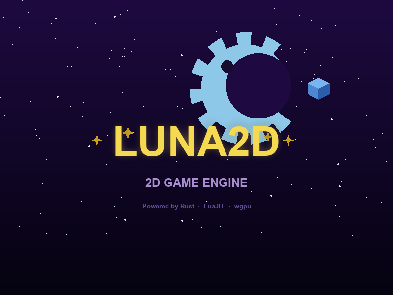



  

        <strong>A small desktop 2D runtime for Lua games.</strong> Rust core - Lua scripting - GPU rendering - AI-first tooling.

---

## Is this repo for you?

- **Yes, if** you want to build 2D desktop games in **Lua** and have the heavy systems (render/audio/physics/IO) handled by **Rust**.
- **Yes, if** you value fast prototyping, moddability, and a clean API under `lurek.*`.
- **Yes, if** you want docs, tests, examples, reference games, and AI workflow tooling in one repo.
- **Probably not**, if you need a mobile/web-first engine or an all-in-one closed editor.

## TL;DR

- **What it is:** a desktop 2D runtime for Lua games.
- **Model:** Rust owns systems, Lua owns game logic.
- **Scope:** rendering, audio, input, physics, scene/tilemap/sprite/tween, save, networking, tooling.
- **Repo contents:** engine + API docs + examples + reference games + Lua libraries + extension tooling.
- **Details:** the full project reference now lives in [wiki/Project-Reference.md](wiki/Project-Reference.md).

## Lurek Is...

| Value | What it means |
|---|---|
| 🧩 **Simple** | Write `main.lua`, call `lurek.*`, and keep gameplay logic in Lua. |
| 🛠️ **Feature rich** | Rendering, audio, input, physics, scene, tilemap, sprite, tween, save, networking, tooling, and more. |
| ⚡ **Fast** | Rust core, queued GPU rendering, and desktop-focused runtime architecture. |
| 🆓 **Free** | MIT-licensed engine, examples, libraries, docs, and tools. |
| 📦 **Portable** | Single-binary runtime, runnable examples, reference games, and optional VS Code tooling in one repo. |
| 🔌 **Extensible** | Pure-Lua libraries, mod hooks, plugins, and AI-assisted workflows. |
| 🌍 **Cross Platform** | Cross-platform desktop targets with separate engine/runtime and tooling layers. |

## Start Here

| Topic | Link | Why open it |
|---|---|---|
| Wiki home | [wiki/Home.md](wiki/Home.md) | Curated entry point for the detailed docs moved out of the root README. |
| Project reference | [wiki/Project-Reference.md](wiki/Project-Reference.md) | Full high-level project overview, module map, use cases, tech stack, and licensing. |
| Lurek API reference | [docs/api/lurek.md](docs/api/lurek.md) | Full public `lurek.*` API surface. |
| Rust API reference | [docs/api/rust.md](docs/api/rust.md) | Engine internals for contributors. |
| Library API reference | [docs/api/library.md](docs/api/library.md) | Generated reference for the pure-Lua libraries. |
| Philosophy | [docs/architecture/philosophy.md](docs/architecture/philosophy.md) | Core rules, constraints, and design assumptions. |
| Architecture index | [docs/architecture/README.md](docs/architecture/README.md) | Navigation across all architecture files. |
| Module specs index | [docs/specs/README.md](docs/specs/README.md) | Canonical per-module contract index. |
| Contributor handbook | [docs/handbook.md](docs/handbook.md) | Onboarding, build/run flow, docs workflow, and quality gates. |
| Changelog | [docs/CHANGELOG.md](docs/CHANGELOG.md) | Current project history. |

## Project Guides

| Guide | Link | Scope |
|---|---|---|
| Examples guide | [content/examples/README.md](content/examples/README.md) | How to use the single-file API examples under `content/examples/`. |
| Detailed project reference | [wiki/Project-Reference.md](wiki/Project-Reference.md) | Runtime modules, game categories, what ships, and project identity. |
| Library API reference | [docs/api/library.md](docs/api/library.md) | Public surface of the bundled pure-Lua libraries. |
| Test suite overview | [tests/README.md](tests/README.md) | Rust/Lua test layout, commands, and coverage rules. |
| VS Code toolkit | [extensions/vscode/README.md](extensions/vscode/README.md) | Extension features, installation, and editor workflow. |
| CAG system | [docs/architecture/cag-system.md](docs/architecture/cag-system.md) | Agent, skill, prompt, and validator model for AI-assisted work. |

## Architecture Files

| File | Link | Focus |
|---|---|---|
| Architecture index | [docs/architecture/README.md](docs/architecture/README.md) | Reading order and cross-links for the architecture set. |
| Philosophy | [docs/architecture/philosophy.md](docs/architecture/philosophy.md) | Constraints, design doctrine, and source-of-truth rules. |
| Engine architecture | [docs/architecture/engine-architecture.md](docs/architecture/engine-architecture.md) | Module groups, runtime composition, boot, and frame model. |
| Render command architecture | [docs/architecture/render-command-architecture.md](docs/architecture/render-command-architecture.md) | Draw-command flow and renderer structure. |
| Test framework | [docs/architecture/test-framework.md](docs/architecture/test-framework.md) | Lua-first test strategy and test placement rules. |
| VS Code architecture | [docs/architecture/vscode-architecture.md](docs/architecture/vscode-architecture.md) | Extension services, debug bridge, and MCP integration. |
| CAG system | [docs/architecture/cag-system.md](docs/architecture/cag-system.md) | Agent graph file types, routing, and validator rules. |
| Lua API file standard | [docs/architecture/lua-api-file-standard.md](docs/architecture/lua-api-file-standard.md) | Conventions for `src/lua_api/*_api.rs`. |
| Plugins | [docs/architecture/plugins.md](docs/architecture/plugins.md) | Plugin boundary and future split strategy. |
| TOGAF mapping | [docs/architecture/togaf.md](docs/architecture/togaf.md) | TOGAF-oriented architecture view of the repo. |

---

[Contributing](CONTRIBUTING.md) - [Security](SECURITY.md) - [License](LICENSE)

