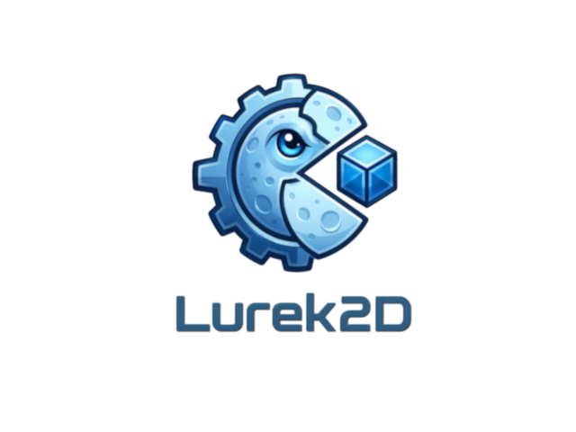

  

  <strong>Lurek2D is a Lua-first 2D runtime and toolkit for games, simulations, visual tools, and interactive desktop apps.</strong>

---

## What Is Lurek?

Lurek2D uses a Rust core for rendering, audio, input, physics, filesystem access, runtime services, and performance-critical systems. Game and app logic stays in Lua through the public `lurek.*` API.

The workflow is code-first: write Lua, call `lurek.*`, run the runtime, iterate quickly. Lurek is not a traditional visual-editor engine, and it is not trying to replace Unity or Godot.

The project is also AI-assisted and agent-friendly. Generated API docs, LuaCATS stubs, specs, examples, tests, and repeatable repo structure are designed to be readable by humans and coding agents. Runtime AI modules are separate features for games, simulations, automation, and learning experiments.

## Best Fit

Use Lurek when you want to build:

- 2D desktop games in Lua
- simulations and strategy sandboxes
- visual experiments, procedural worlds, and interactive demos
- education projects and hackathon prototypes
- small local tools with UI, data, rendering, and scripting
- moddable Lua systems on top of a Rust runtime
- AI-assisted Lua workflows with generated docs and stubs

## Not The Goal

Lurek is not mobile-first, web-first, 3D-first, or editor-first. It does not center the workflow around a visual scene editor. The runtime is a single binary, and the primary authoring surface is Lua code.

## Start Here

| Step | Link | Purpose |
|---|---|---|
| 1 | [GitHub Pages documentation](https://lurek2d.github.io/lurek_2d_pages/) | Official public docs entry point. |
| 2 | [Getting Started](https://lurek2d.github.io/lurek_2d/getting-started.html) | First commands and project shape. |
| 3 | [First Game](https://lurek2d.github.io/lurek_2d/first-game.html) | Minimal `main.lua` with update and draw callbacks. |
| 4 | [Lua API Overview](https://lurek2d.github.io/lurek_2d/lua-api.html) | How to read and use the generated `lurek.*` API. |
| 5 | [Full Lua API Reference](https://lurek2d.github.io/lurek_2d/api/lurek.html) | Complete generated public API reference. |

## Documentation Map

| Area | Source | Role |
|---|---|---|
| Public docs | [GitHub Pages](https://lurek2d.github.io/lurek_2d/) | Main user documentation for onboarding, API, examples, and module guides. |
| Lua API | [docs/api/lurek.md](docs/api/lurek.md) | Generated full reference for `lurek.*`; published through Pages. |
| Lua stubs | [docs/api/lurek.lua](docs/api/lurek.lua) | Generated LuaCATS/EmmyLua declarations for editor tooling and agents. |
| Module guides | [docs/modules/](docs/modules/) | Generated module pages combining purpose, examples, and API details. |
| Examples | [content/examples/README.md](content/examples/README.md) | Runnable one-file examples for public API coverage. |
| Content | [`lurek_2d_content`](lurek_2d_content/README.md) | Games, reusable Lua libraries, and design references in a nested repository. |
| VS Code extension | [`lurek_2d_extension`](lurek_2d_extension/README.md) | Standalone VS Code extension repository. |
| Workbench | [`lurek_2d_workbench`](lurek_2d_workbench/README.md) | Standalone native Lurek Workbench repository. |
| Wiki | [docs/wiki/Home.md](docs/wiki/Home.md) | Generated cookbook/onboarding/FAQ-style material, not the API source of truth. |
| Architecture | [docs/architecture/](docs/architecture/) | Contributor-facing design, positioning, boundaries, and durable decisions. |
| Specs | [docs/specs/README.md](docs/specs/README.md) | Contributor-facing generated module contracts and technical source of truth. |

## Lua API

The public scripting surface lives under `lurek.*`. The generated API reference is the authoritative user-facing source for signatures, parameters, returns, and examples:

- [Full Lua API Reference](docs/api/lurek.md)
- [Runtime callbacks](docs/api/callbacks.md)
- [LuaCATS editor stub](docs/api/lurek.lua)
- [Lureksome library API](docs/api/lureksome.md)

For VS Code and Lua language servers, point workspace library settings at `docs/api/lurek.lua` so completions and hover text come from the generated stub.

## Examples And Reference Games

- [Examples guide](content/examples/README.md) explains the one-file examples under `content/examples/`.
- [Content catalog](lurek_2d_content/README.md) covers complete games, reusable Lua libraries, and game-design references.
- Pages also includes [Examples](https://lurek2d.github.io/lurek_2d/examples.html) and [Reference Games](https://lurek2d.github.io/lurek_2d/reference-games.html) indexes.

## For Contributors

Engine contributors should start from:

- [Architecture overview](docs/architecture/engine-core.md)
- [Documentation strategy](docs/architecture/documentation-strategy.md)
- [Positioning](docs/architecture/market-positioning.md)
- [Specs index](docs/specs/README.md)
- [Documentation system](docs/architecture/docs-system.md)
- [Tests and quality gates](tests/README.md)

Generated outputs should not be edited by hand. Update source doc comments, spec manual overlays, examples, metadata, or docs generators, then regenerate.

## Development Status

Lurek2D is an active Lua/Rust runtime project. This repository contains the Rust engine, source documentation, examples, tests, and CAG guidance. The published site, game content, VS Code extension, and Workbench are nested sibling repositories: `lurek_2d_pages/`, `lurek_2d_content/`, `lurek_2d_extension/`, and `lurek_2d_workbench/`.

---

[Contributing](CONTRIBUTING.md) - [Security](SECURITY.md) - [License](LICENSE)
