# Lurek2D Demo Catalog

This catalog is generated from runnable `content/games/<category>/<name>` folders and the product decisions in issue #30.
It separates playable catalog candidates from rewrite and trim work so skeletons are not presented as complete games.

## Run

```powershell
cargo run -- content/games/<category>/<name>
python tools/demos/audit_games.py
python tools/demos/gen_demo_catalog.py
```

## Status Rules

- `KEEP` rows are public catalog candidates once README, screen, preview GIF, validation, and smoke evidence are current.
- `REWRITE_API` and `TRIM` rows stay visible as priority public work, but are not advertised as finished.
- `MOVE_EXAMPLE` and `MOVE_INCUBATOR` rows belong on `content/showcase/` or `content/games/_incubator/` once migrated.
- Unresolved `MERGE_OR_DROP` rows are listed only while duplicate ownership remains unresolved.

## Catalog Candidates

| Demo | Type | Decision | Status | APIs | Preview | Run |
|---|---|---|---|---|---|---|
| [Asteroids](./arcade/asteroids) | `arcade` | `KEEP` | unspecified; smoke:PASS | `automation`, `camera`, `event`, `input`, `particle`, `render`, `timer`, +3 | 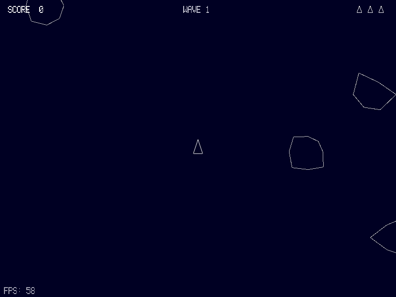 | `cargo run -- content/games/arcade/asteroids` |
| [Centipede](./arcade/centipede) | `arcade` | `KEEP` | unspecified; smoke:NO_IMAGE; known-failing:content-demo-maintainers (exited cleanly but no PNG written) | `automation`, `event`, `input`, `particle`, `render`, `timer`, `tween`, +2 | 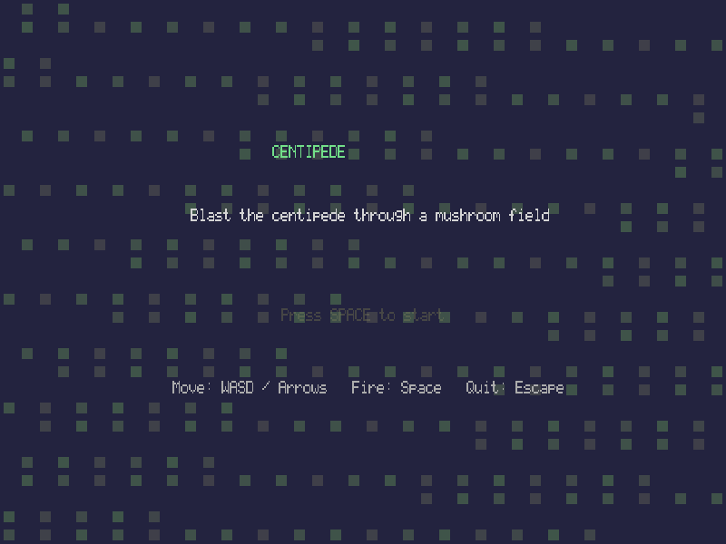 | `cargo run -- content/games/arcade/centipede` |
| [Dyna Blaster](./arcade/dyna_blaster) | `arcade` | `KEEP` | unspecified; smoke:PASS | `ai`, `automation`, `ecs`, `event`, `input`, `pathfind`, `render`, +4 | 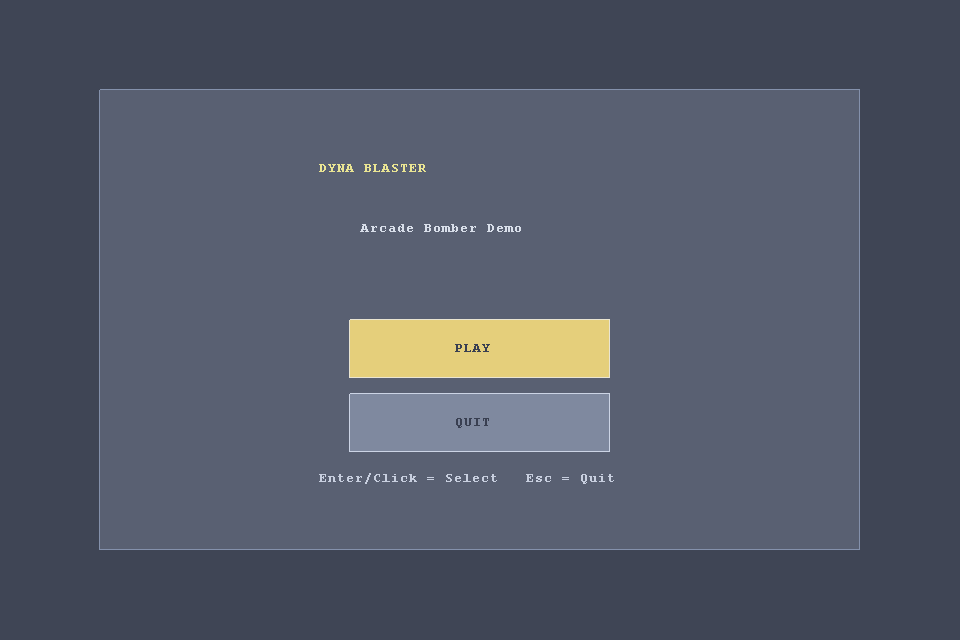 | `cargo run -- content/games/arcade/dyna_blaster` |
| [Frogger](./arcade/frogger) | `arcade` | `KEEP` | unspecified; smoke:NO_IMAGE; known-failing:content-demo-maintainers (exited cleanly but no PNG written) | `automation`, `camera`, `event`, `input`, `render`, `timer`, `ui`, +1 | 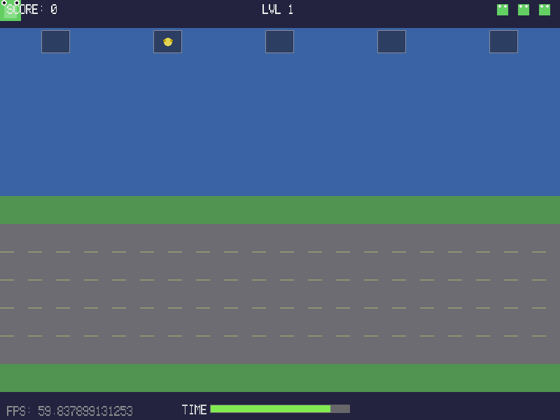 | `cargo run -- content/games/arcade/frogger` |
| [Maze Chase](./arcade/pac_man) | `arcade` | `KEEP` | playable rewrite; smoke:PASS | `automation`, `event`, `input`, `particle`, `render`, `timer`, `window` |  | `cargo run -- content/games/arcade/pac_man` |
| [Pong](./arcade/pong) | `arcade` | `KEEP` | unspecified; smoke:PASS | `automation`, `event`, `input`, `particle`, `render`, `timer`, `tween`, +2 | 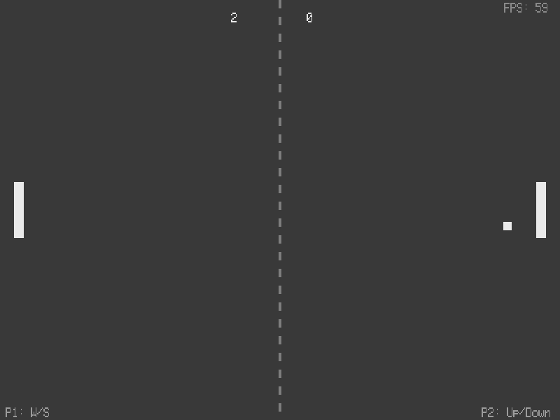 | `cargo run -- content/games/arcade/pong` |
| [Snake](./arcade/snake) | `arcade` | `KEEP` | unspecified; smoke:NO_IMAGE; known-failing:content-demo-maintainers (exited cleanly but no PNG written) | `automation`, `camera`, `event`, `input`, `particle`, `ready`, `render`, +4 | 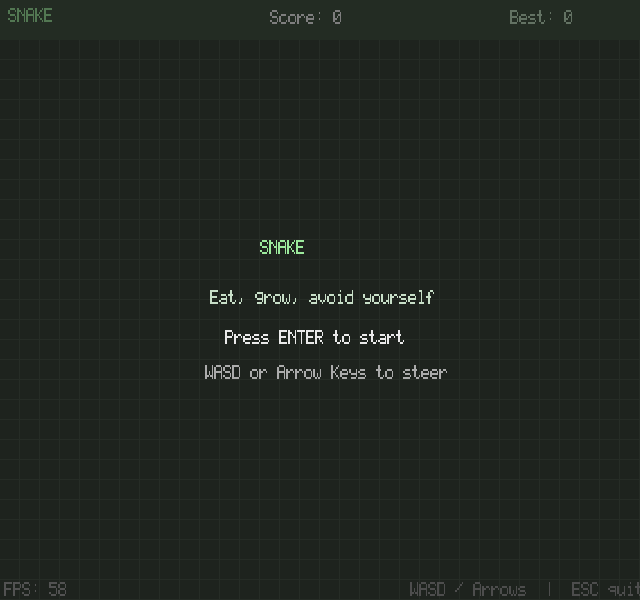 | `cargo run -- content/games/arcade/snake` |
| [Space Invaders](./arcade/space_invaders) | `arcade` | `KEEP` | unspecified; smoke:PASS | `automation`, `camera`, `event`, `input`, `render`, `timer`, `ui`, +1 | 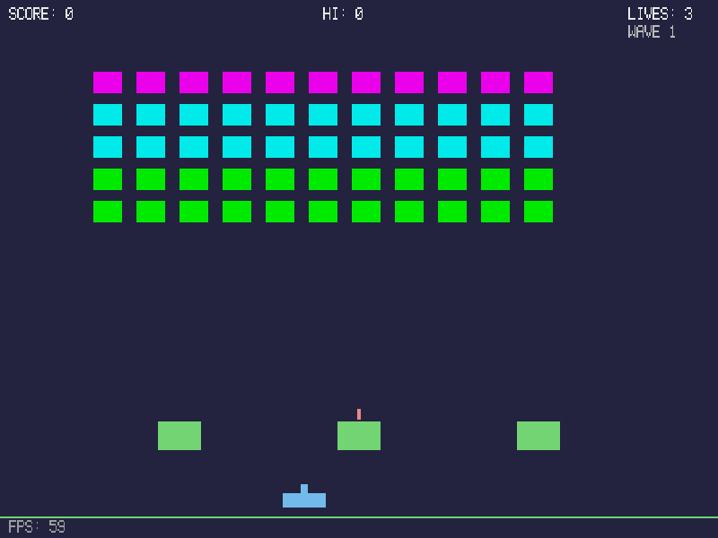 | `cargo run -- content/games/arcade/space_invaders` |
| [Falling Blocks](./arcade/tetris) | `arcade` | `KEEP` | playable rewrite; smoke:PASS | `automation`, `event`, `input`, `particle`, `render`, `timer`, `tween`, +2 |  | `cargo run -- content/games/arcade/tetris` |
| [Brick Breaker](./action/brick_breaker) | `action` | `KEEP` | unspecified; smoke:NO_IMAGE; known-failing:content-demo-maintainers (exited cleanly but no PNG written) | `automation`, `camera`, `event`, `input`, `particle`, `render`, `timer`, +3 | 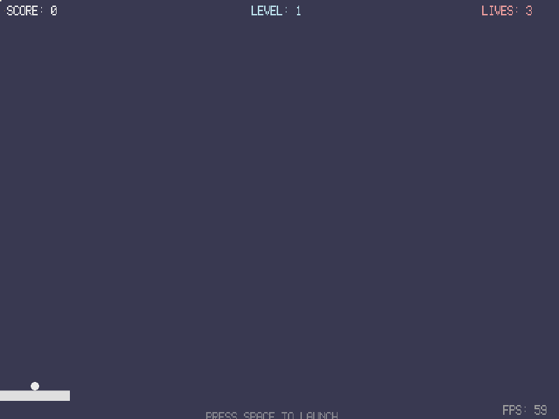 | `cargo run -- content/games/action/brick_breaker` |
| [Bullet Hell](./action/bullet_hell) | `action` | `KEEP` | unspecified; smoke:NO_IMAGE; known-failing:content-demo-maintainers (exited cleanly but no PNG written) | `automation`, `camera`, `event`, `input`, `render`, `timer`, `ui`, +1 | 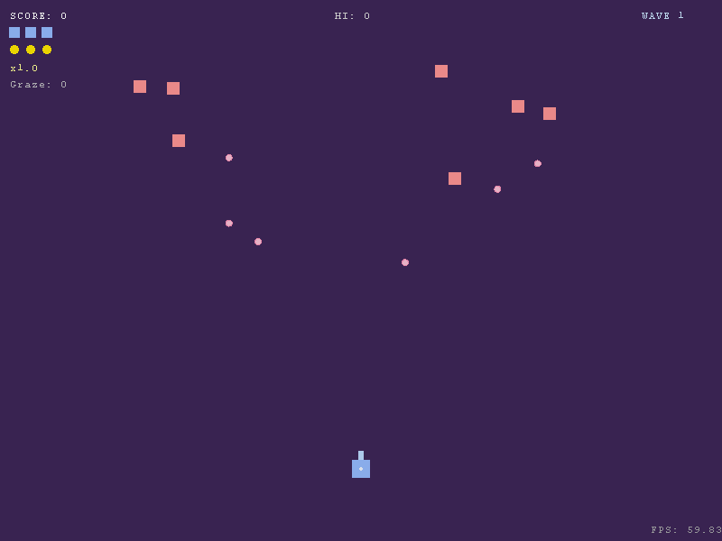 | `cargo run -- content/games/action/bullet_hell` |
| [Cannon Fodder](./action/cannon_fodder) | `action` | `KEEP` | unspecified; smoke:PASS | `automation`, `event`, `math`, `render`, `ui`, `window` |  | `cargo run -- content/games/action/cannon_fodder` |
| [Endless Runner](./action/endless_runner) | `action` | `KEEP` | unspecified; smoke:NO_IMAGE; known-failing:content-demo-maintainers (exited cleanly but no PNG written) | `automation`, `event`, `input`, `particle`, `render`, `timer`, `tween`, +2 | 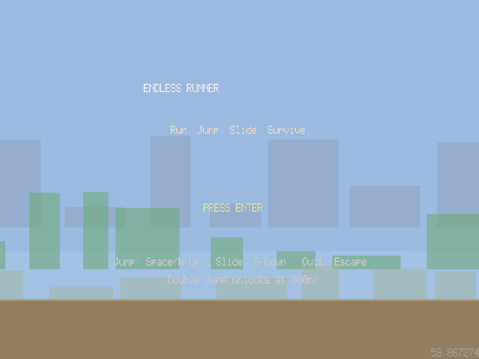 | `cargo run -- content/games/action/endless_runner` |
| [Horde Survivor](./action/horde_survivor) | `action` | `KEEP` | unspecified; smoke:NO_IMAGE; known-failing:content-demo-maintainers (exited cleanly but no PNG written) | `automation`, `camera`, `event`, `input`, `particle`, `render`, `timer`, +3 | 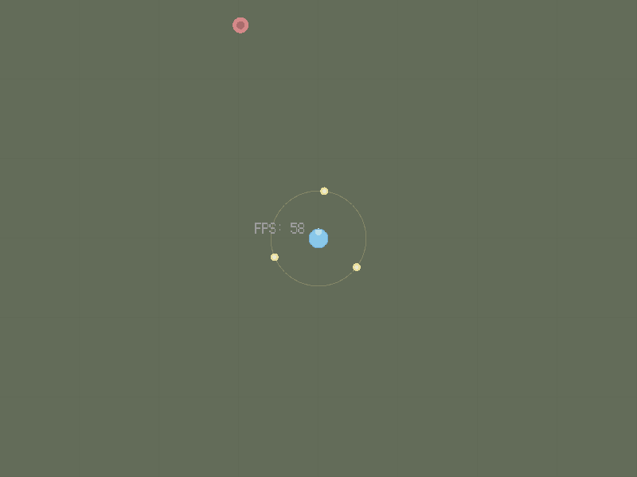 | `cargo run -- content/games/action/horde_survivor` |
| [Infiltration](./action/infiltration) | `action` | `KEEP` | unspecified; smoke:NO_IMAGE; known-failing:content-demo-maintainers (exited cleanly but no PNG written) | `automation`, `event`, `input`, `particle`, `ready`, `render`, `timer`, +2 | 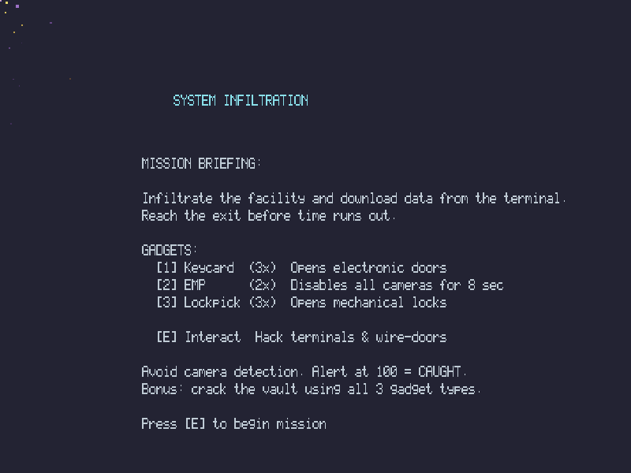 | `cargo run -- content/games/action/infiltration` |
| [Sniper](./action/sniper) | `action` | `KEEP` | unspecified; smoke:PASS | `automation`, `event`, `input`, `render`, `ui`, `window` | 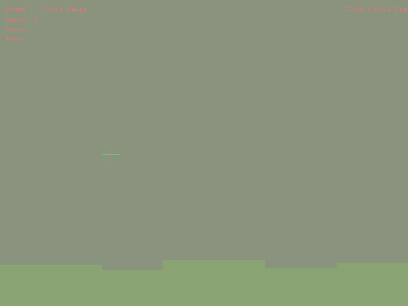 | `cargo run -- content/games/action/sniper` |
| [Stealth](./action/stealth) | `action` | `KEEP` | unspecified; smoke:PASS | `automation`, `camera`, `event`, `input`, `particle`, `render`, `timer`, +3 | 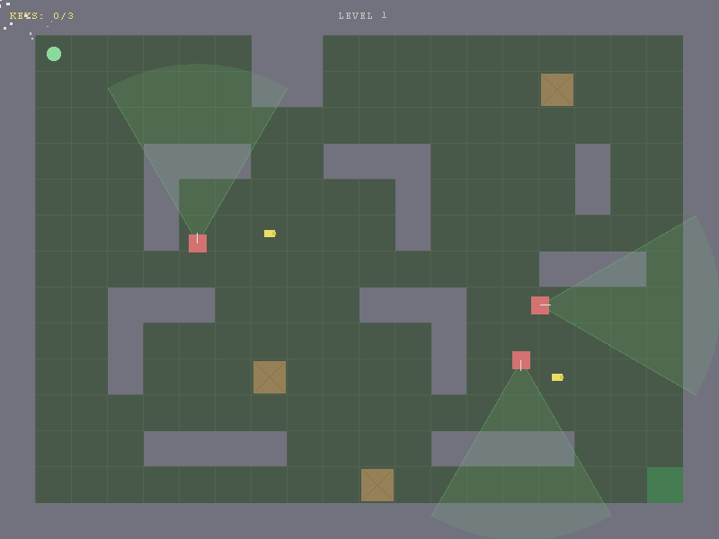 | `cargo run -- content/games/action/stealth` |
| [Vertical Climber](./action/vertical_climber) | `action` | `KEEP` | unspecified; smoke:PASS | `automation`, `camera`, `event`, `input`, `particle`, `render`, `timer`, +3 | 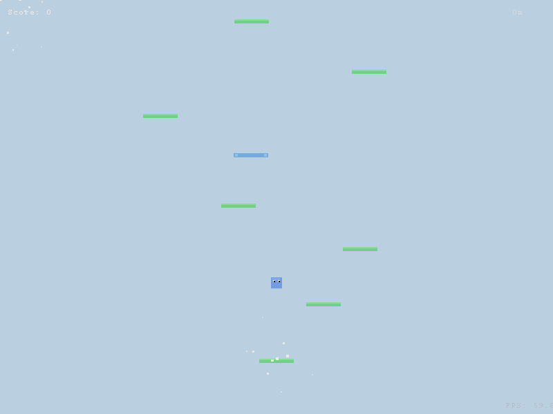 | `cargo run -- content/games/action/vertical_climber` |
| [Adventure](./rpg/adventure) | `rpg` | `KEEP` | unspecified; smoke:PASS | `automation`, `camera`, `event`, `input`, `particle`, `render`, `timer`, +3 | 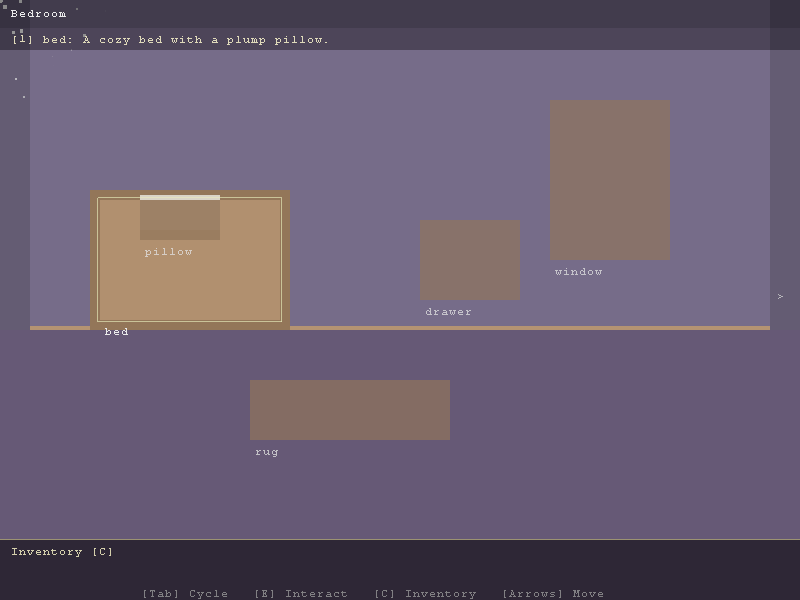 | `cargo run -- content/games/rpg/adventure` |
| [Alchemy](./rpg/alchemy) | `rpg` | `KEEP` | unspecified; smoke:PASS | `automation`, `camera`, `event`, `input`, `render`, `timer`, `ui`, +1 | 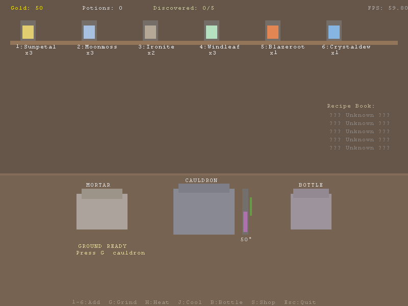 | `cargo run -- content/games/rpg/alchemy` |
| [Courtroom](./rpg/courtroom) | `rpg` | `KEEP` | unspecified; smoke:PASS | `automation`, `event`, `input`, `render`, `timer`, `ui`, `window` | 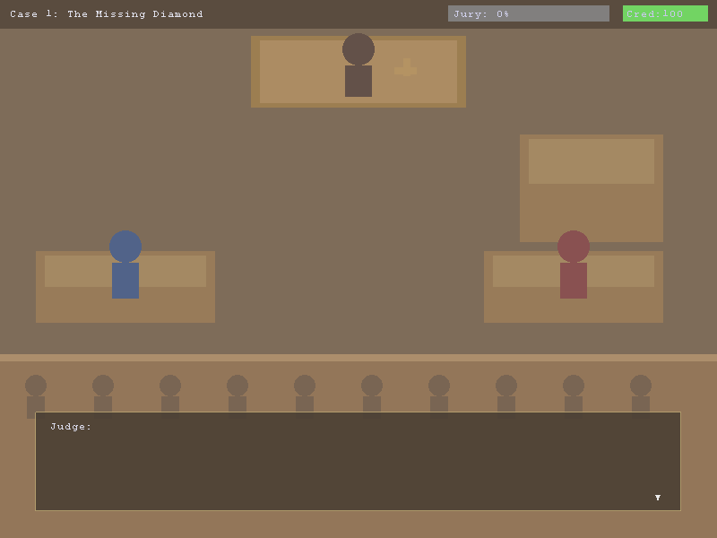 | `cargo run -- content/games/rpg/courtroom` |
| [Dungeon Eye](./rpg/dungeon_eye) | `rpg` | `KEEP` | unspecified; smoke:PASS | `automation`, `event`, `raycaster`, `render`, `window` | 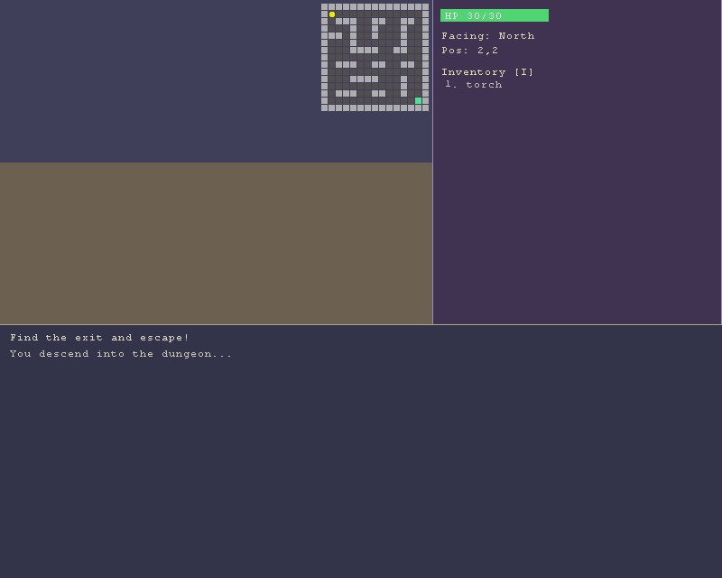 | `cargo run -- content/games/rpg/dungeon_eye` |
| [Loot Rpg](./rpg/loot_rpg) | `rpg` | `KEEP` | unspecified; smoke:PASS | `automation`, `camera`, `event`, `input`, `particle`, `render`, `timer`, +2 | 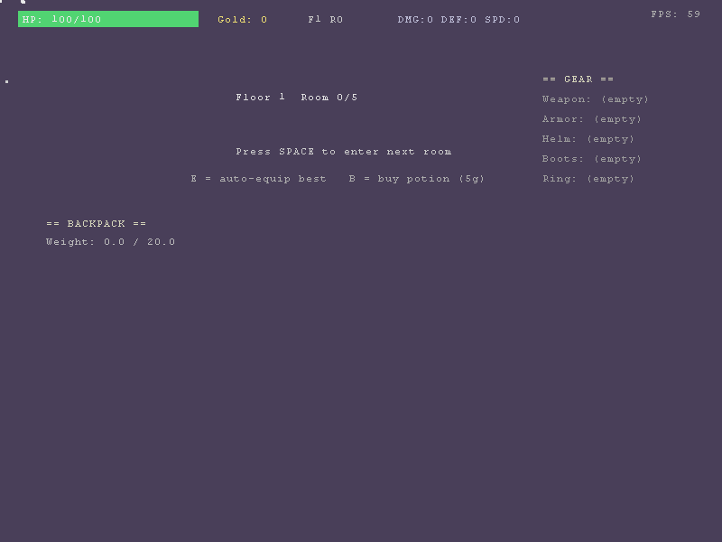 | `cargo run -- content/games/rpg/loot_rpg` |
| [Merchant](./rpg/merchant) | `rpg` | `KEEP` | unspecified; smoke:PASS | `automation`, `camera`, `event`, `input`, `render`, `timer`, `window` | 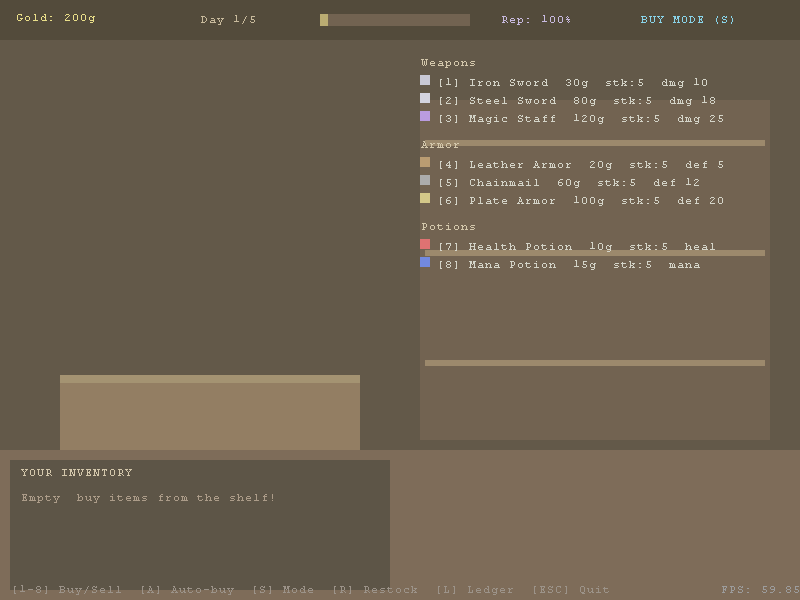 | `cargo run -- content/games/rpg/merchant` |
| [Roguelike](./rpg/roguelike) | `rpg` | `KEEP` | unspecified; smoke:NO_IMAGE; known-failing:content-demo-maintainers (exited cleanly but no PNG written) | `automation`, `camera`, `event`, `input`, `render`, `timer`, `window` | 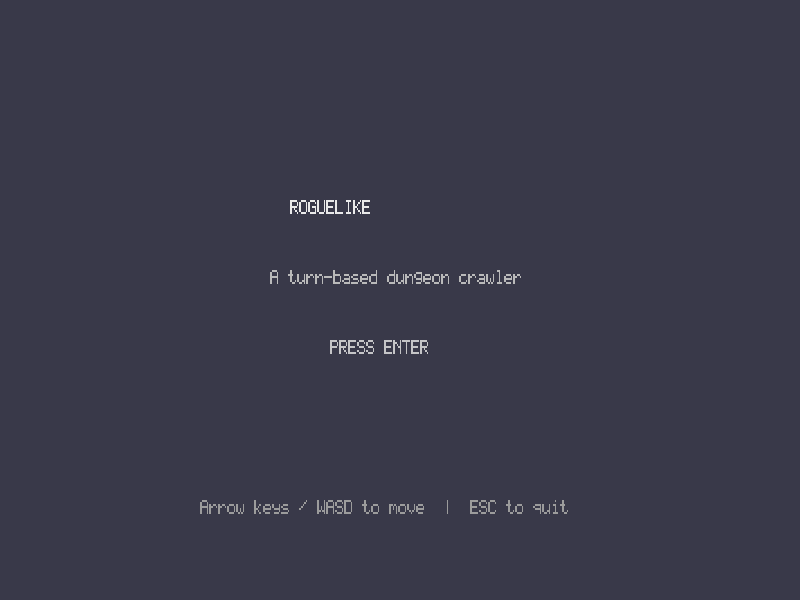 | `cargo run -- content/games/rpg/roguelike` |
| [Visual Novel](./rpg/visual_novel) | `rpg` | `KEEP` | unspecified; smoke:PASS | `automation`, `event`, `input`, `render`, `timer`, `window` | 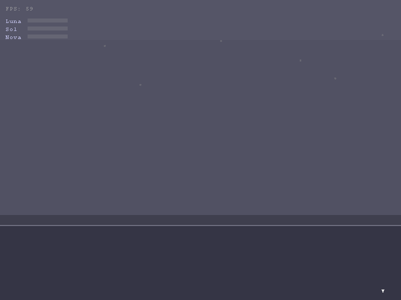 | `cargo run -- content/games/rpg/visual_novel` |
| [Bridge Builder](./strategy/bridge_builder) | `strategy` | `KEEP` | unspecified; smoke:NO_IMAGE; known-failing:content-demo-maintainers (exited cleanly but no PNG written) | `automation`, `camera`, `event`, `input`, `particle`, `render`, `timer`, +2 | 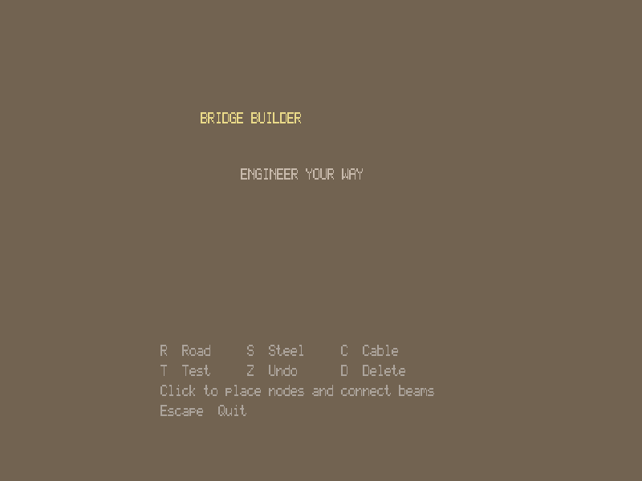 | `cargo run -- content/games/strategy/bridge_builder` |
| [Card Game](./strategy/card_game) | `strategy` | `KEEP` | unspecified; smoke:PASS | `automation`, `camera`, `event`, `input`, `render`, `timer`, `window` | 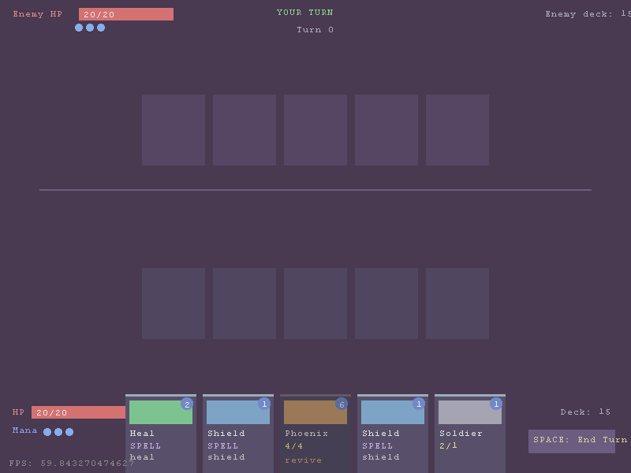 | `cargo run -- content/games/strategy/card_game` |
| [Deckbuilder](./strategy/deckbuilder) | `strategy` | `KEEP` | unspecified; smoke:PASS | `automation`, `event`, `input`, `particle`, `render`, `tween`, `window` | 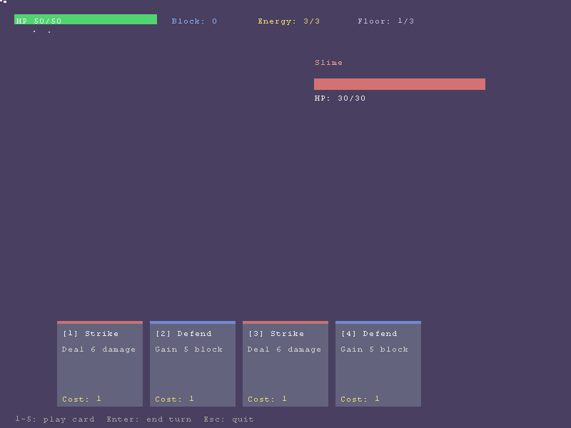 | `cargo run -- content/games/strategy/deckbuilder` |
| [Hex Logistics](./strategy/hex_logistics) | `strategy` | `KEEP` | unspecified; smoke:PASS | `automation`, `event`, `input`, `math`, `render`, `tilemap`, `timer`, +1 |  | `cargo run -- content/games/strategy/hex_logistics` |
| [Hex Strategy](./strategy/hex_strategy) | `strategy` | `KEEP` | unspecified; smoke:PASS | `automation`, `event`, `input`, `particle`, `render`, `window` | 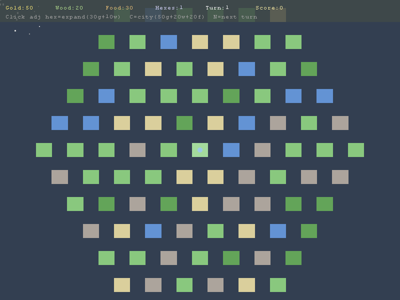 | `cargo run -- content/games/strategy/hex_strategy` |
| [Logic Game](./strategy/logic_game) | `strategy` | `KEEP` | unspecified; smoke:PASS | `automation`, `event`, `input`, `particle`, `render`, `window` | 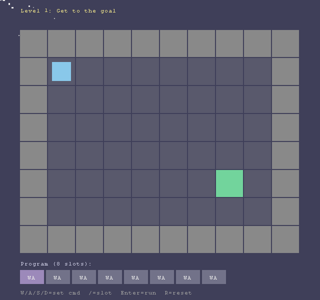 | `cargo run -- content/games/strategy/logic_game` |
| [Match3](./strategy/match3) | `strategy` | `KEEP` | unspecified; smoke:PASS | `automation`, `event`, `input`, `particle`, `render`, `window` | 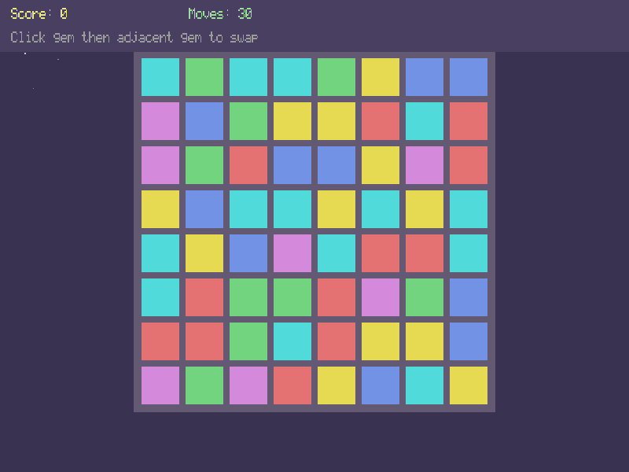 | `cargo run -- content/games/strategy/match3` |
| [Maze Defense](./strategy/maze_defense) | `strategy` | `KEEP` | unspecified; smoke:PASS | `automation`, `event`, `input`, `particle`, `render`, `window` | 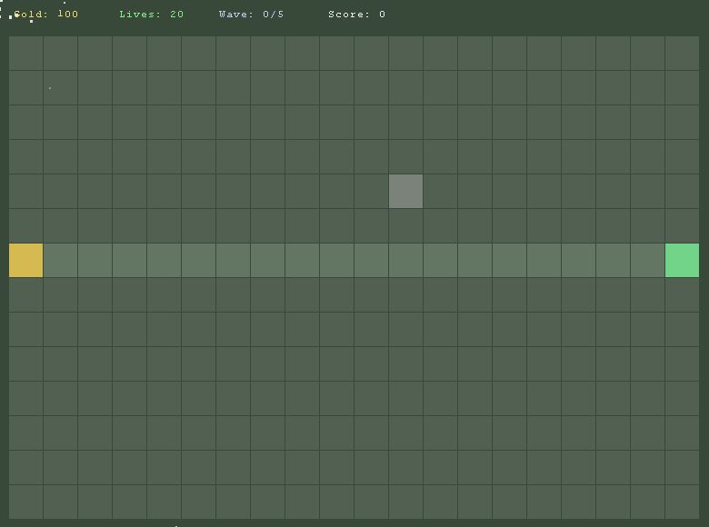 | `cargo run -- content/games/strategy/maze_defense` |
| [Physics Puzzle](./strategy/physics_puzzle) | `strategy` | `KEEP` | unspecified; smoke:PASS | `automation`, `event`, `input`, `particle`, `render`, `window` | 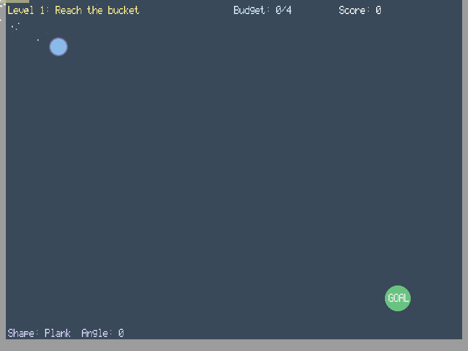 | `cargo run -- content/games/strategy/physics_puzzle` |
| [Tactical Battle](./strategy/tactical_battle) | `strategy` | `KEEP` | unspecified; smoke:PASS | `automation`, `event`, `input`, `particle`, `render`, `window` | 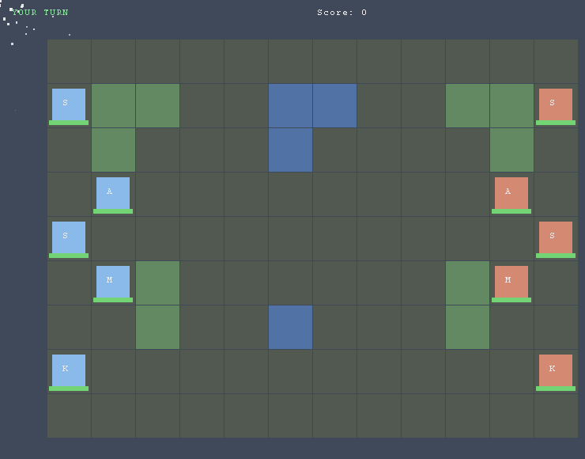 | `cargo run -- content/games/strategy/tactical_battle` |
| [Tower Defense](./strategy/tower_defense) | `strategy` | `KEEP` | unspecified; smoke:PASS | `automation`, `event`, `input`, `particle`, `render`, `window` | 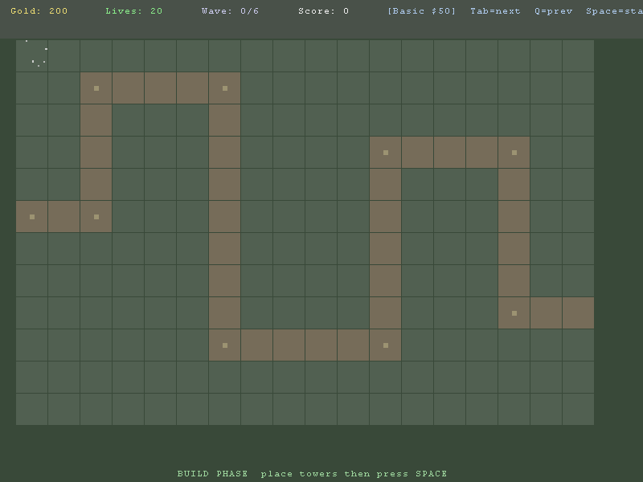 | `cargo run -- content/games/strategy/tower_defense` |
| [Cooking Sim](./simulation/cooking_sim) | `simulation` | `KEEP` | unspecified; smoke:PASS | `automation`, `camera`, `event`, `input`, `render`, `timer`, `window` | 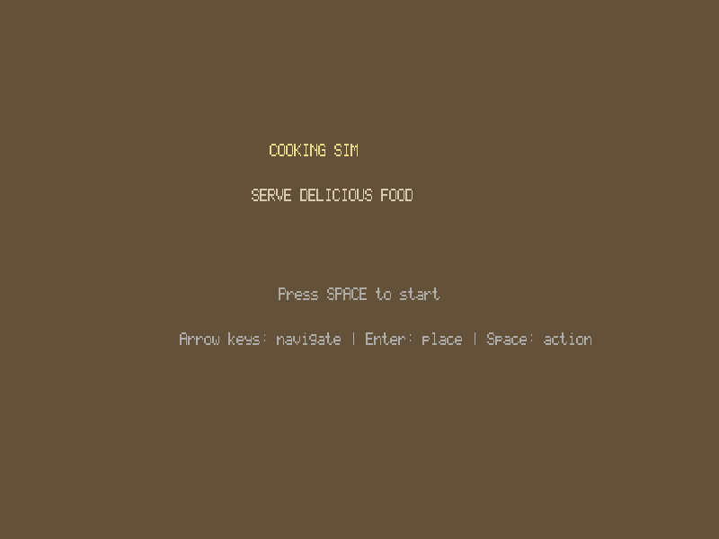 | `cargo run -- content/games/simulation/cooking_sim` |
| [Factory](./simulation/factory) | `simulation` | `KEEP` | unspecified; smoke:NO_IMAGE; known-failing:content-demo-maintainers (exited cleanly but no PNG written) | `automation`, `event`, `input`, `render`, `timer`, `window` | 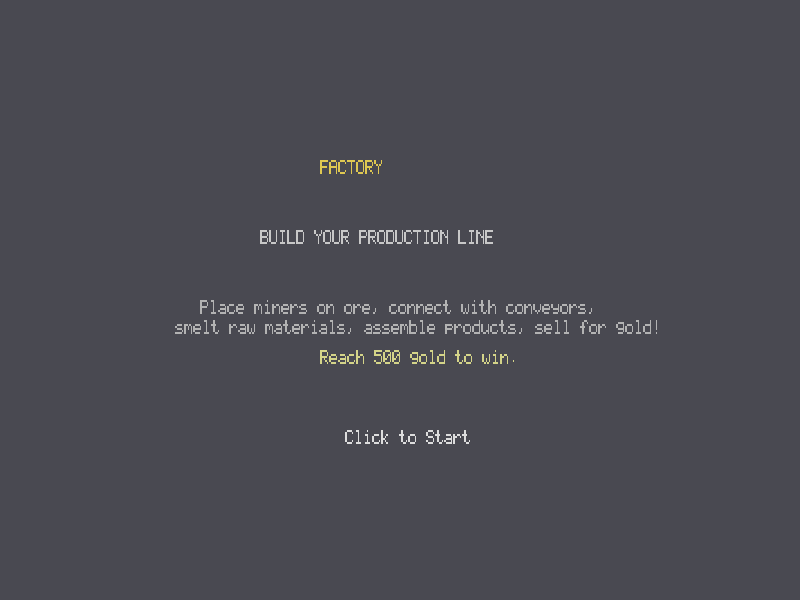 | `cargo run -- content/games/simulation/factory` |
| [Idle Game](./simulation/idle_game) | `simulation` | `KEEP` | unspecified; smoke:PASS | `automation`, `camera`, `event`, `input`, `render`, `timer`, `window` | 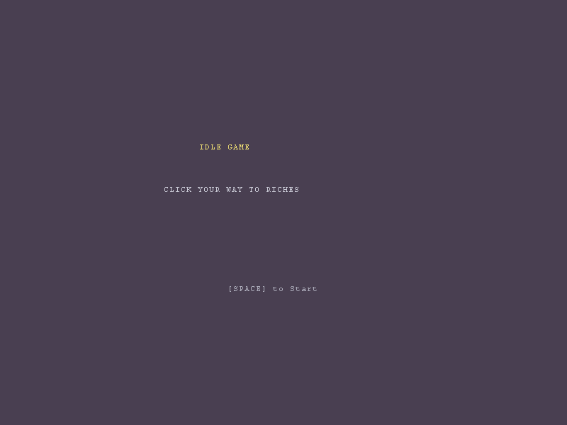 | `cargo run -- content/games/simulation/idle_game` |
| [Mining](./simulation/mining) | `simulation` | `KEEP` | unspecified; smoke:PASS | `automation`, `camera`, `event`, `input`, `render`, `timer`, `window` | 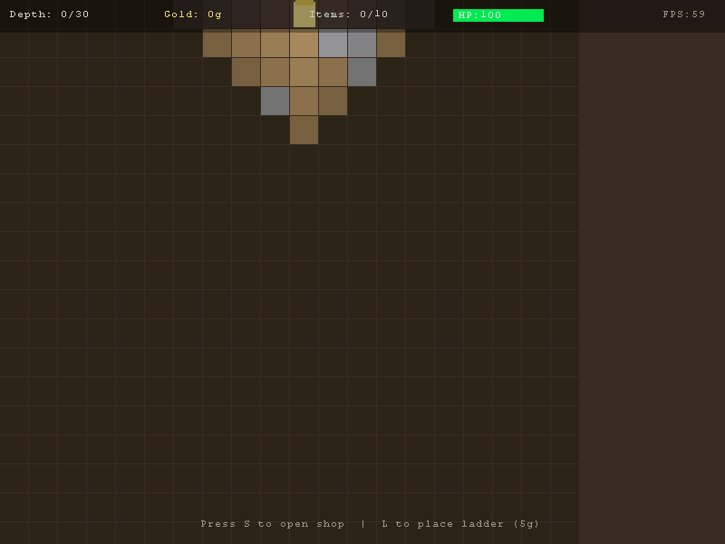 | `cargo run -- content/games/simulation/mining` |
| [Wildlife Photo](./simulation/wildlife_photo) | `simulation` | `KEEP` | unspecified; smoke:PASS | `automation`, `camera`, `event`, `input`, `particle`, `render`, `timer`, +2 | 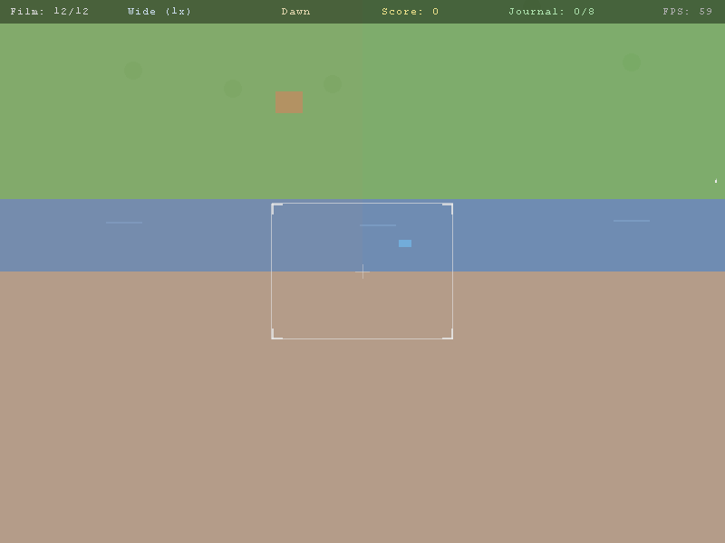 | `cargo run -- content/games/simulation/wildlife_photo` |
| [Boxing Ring](./sports/boxing_ring) | `sports` | `KEEP` | unspecified; smoke:NO_IMAGE; known-failing:content-demo-maintainers (exited cleanly but no PNG written) | `automation`, `camera`, `event`, `input`, `particle`, `render`, `timer`, +3 | 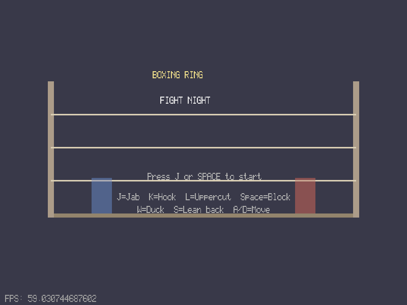 | `cargo run -- content/games/sports/boxing_ring` |
| [Drift Racing](./sports/drift_racing) | `sports` | `KEEP` | unspecified; smoke:NO_IMAGE; known-failing:content-demo-maintainers (exited cleanly but no PNG written) | `automation`, `event`, `input`, `render`, `timer`, `ui`, `window` | 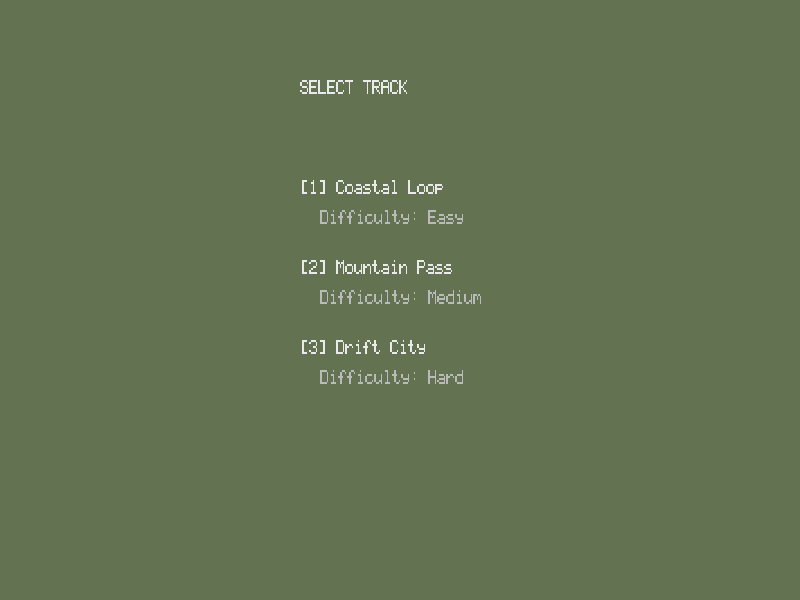 | `cargo run -- content/games/sports/drift_racing` |
| [Fishing](./sports/fishing) | `sports` | `KEEP` | unspecified; smoke:NO_IMAGE; known-failing:content-demo-maintainers (exited cleanly but no PNG written) | `automation`, `event`, `input`, `render`, `timer`, `ui`, `window` | 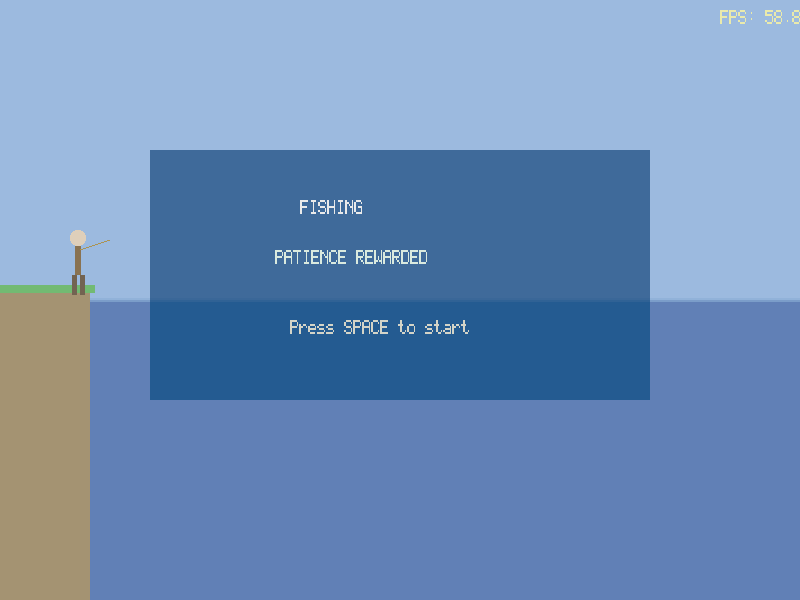 | `cargo run -- content/games/sports/fishing` |
| [Golf Classic](./sports/golf_classic) | `sports` | `KEEP` | unspecified; smoke:PASS | `event`, `input`, `render`, `timer`, `window` | 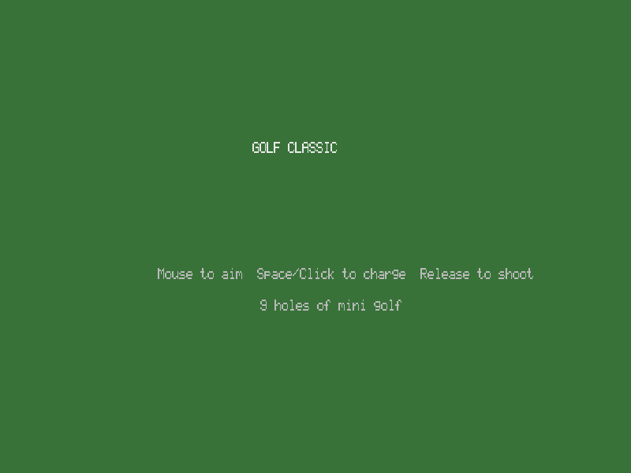 | `cargo run -- content/games/sports/golf_classic` |
| [Pinball](./sports/pinball) | `sports` | `KEEP` | unspecified; smoke:NO_IMAGE; known-failing:content-demo-maintainers (exited cleanly but no PNG written) | `automation`, `event`, `input`, `render`, `timer`, `ui`, `window` | 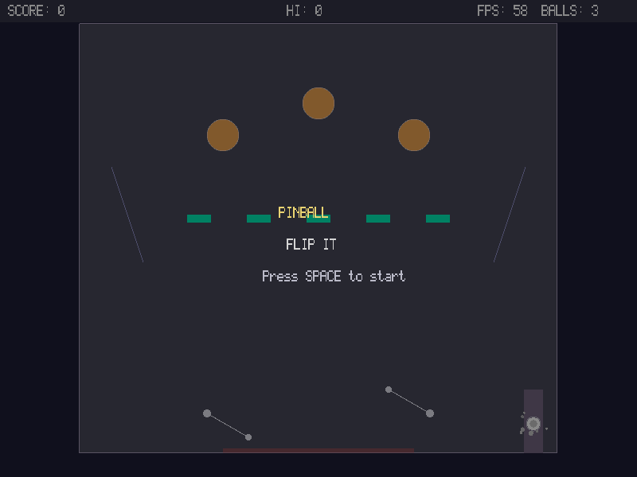 | `cargo run -- content/games/sports/pinball` |
| [Rhythm Game](./sports/rhythm_game) | `sports` | `KEEP` | unspecified; smoke:NO_IMAGE; known-failing:content-demo-maintainers (exited cleanly but no PNG written) | `automation`, `camera`, `event`, `input`, `particle`, `render`, `timer`, +3 | 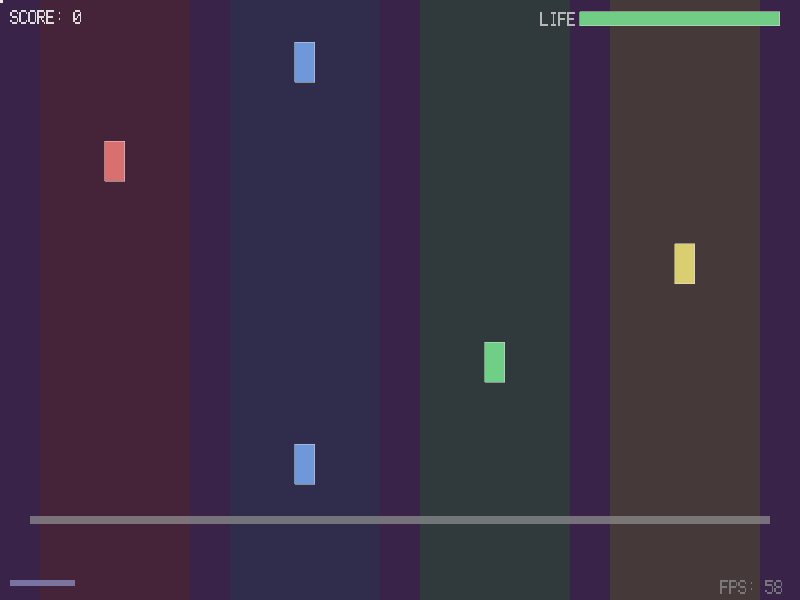 | `cargo run -- content/games/sports/rhythm_game` |
| [Ski Jump](./sports/ski_jump) | `sports` | `KEEP` | unspecified; smoke:NO_IMAGE; known-failing:content-demo-maintainers (exited cleanly but no PNG written) | `automation`, `event`, `input`, `render`, `timer`, `ui`, `window` | 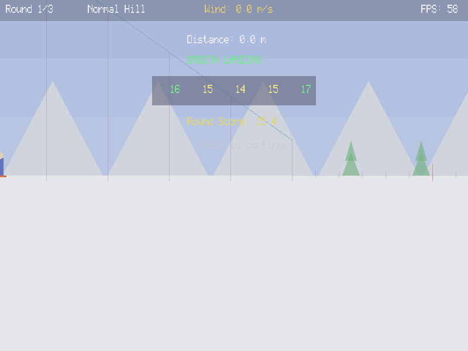 | `cargo run -- content/games/sports/ski_jump` |
| [Tennis Classic](./sports/tennis_classic) | `sports` | `KEEP` | unspecified; smoke:NO_IMAGE; known-failing:content-demo-maintainers (exited cleanly but no PNG written) | `automation`, `camera`, `event`, `input`, `particle`, `render`, `timer`, +2 | 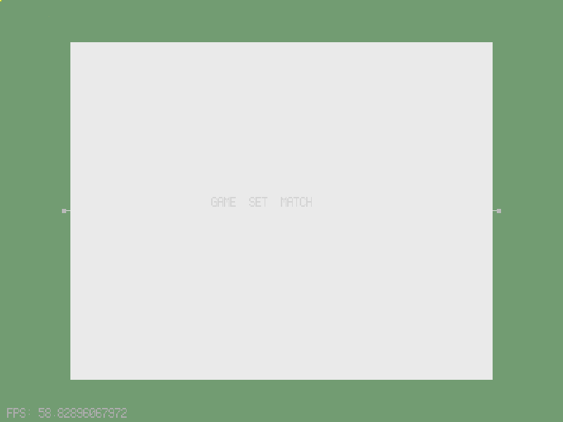 | `cargo run -- content/games/sports/tennis_classic` |
| [Track And Field](./sports/track_and_field) | `sports` | `KEEP` | unspecified; smoke:NO_IMAGE; known-failing:content-demo-maintainers (exited cleanly but no PNG written) | `automation`, `camera`, `event`, `input`, `particle`, `ready`, `render`, +4 | 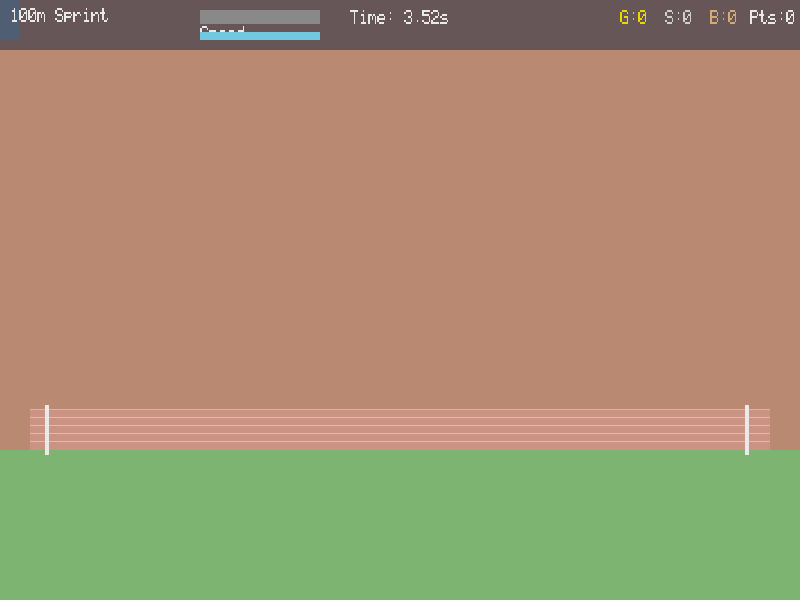 | `cargo run -- content/games/sports/track_and_field` |
| [Learning Route Attention Lab](./apps/learning_route_attention_lab) | `apps` | `KEEP` | unspecified; smoke:PASS | `learning` |  | `cargo run -- content/games/apps/learning_route_attention_lab` |
| [Learning Sales Forecast Lab](./apps/learning_sales_forecast_lab) | `apps` | `KEEP` | unspecified; smoke:PASS | `learning` |  | `cargo run -- content/games/apps/learning_sales_forecast_lab` |
| [Mapblock Labyrinth](./puzzle/mapblock_labyrinth) | `puzzle` | `KEEP` | playable; smoke:PASS | `event`, `image`, `mapblock`, `render`, `window` | 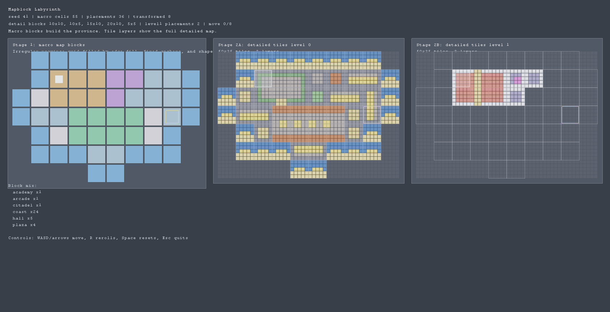 | `cargo run -- content/games/puzzle/mapblock_labyrinth` |
| [Commando](./retro/commando) | `retro` | `KEEP` | unspecified; smoke:NO_IMAGE; known-failing:content-demo-maintainers (exited cleanly but no PNG written) | `automation`, `camera`, `event`, `input`, `render`, `timer`, `ui`, +1 | 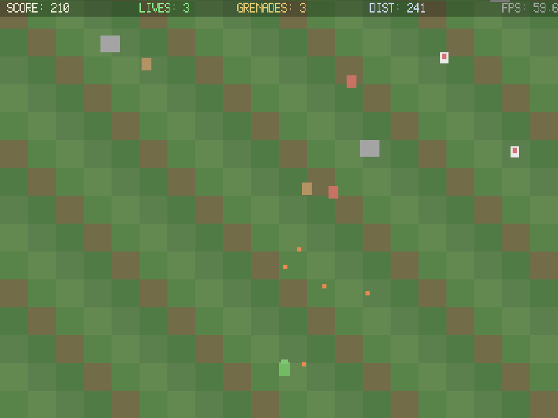 | `cargo run -- content/games/retro/commando` |
| [Raycaster Fps](./retro/raycaster_fps) | `retro` | `KEEP` | unspecified; smoke:PASS | `automation`, `camera`, `event`, `input`, `render`, `timer`, `ui`, +1 | 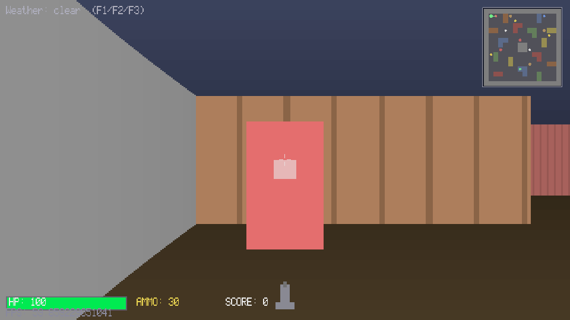 | `cargo run -- content/games/retro/raycaster_fps` |
| [Demo Game](./showcase/demo_game) | `showcase` | `KEEP` | unspecified; smoke:PASS | `automation`, `camera`, `event`, `input`, `particle`, `render`, `timer`, +2 | 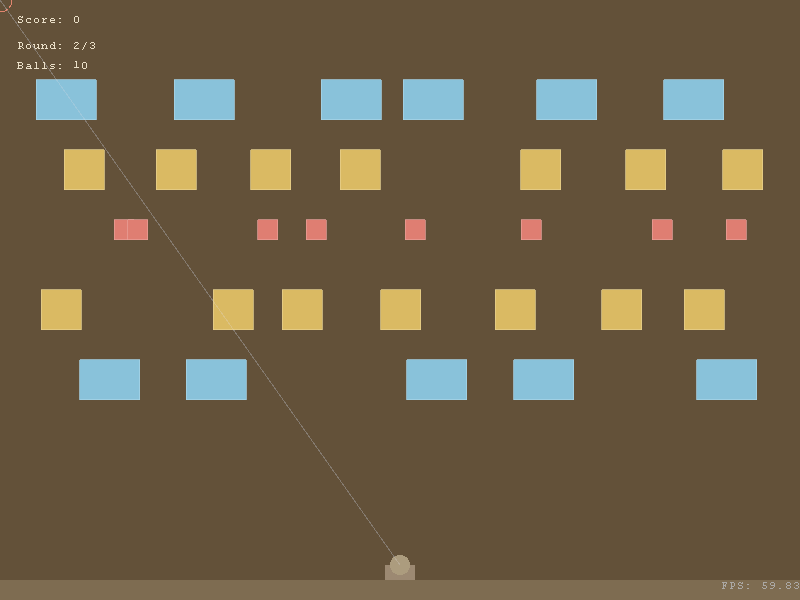 | `cargo run -- content/games/showcase/demo_game` |
| [Globe Demo](./showcase/globe_demo) | `showcase` | `KEEP` | unspecified; smoke:NO_IMAGE; known-failing:content-demo-maintainers (exited cleanly but no PNG written) | `automation`, `event`, `globe`, `input`, `log`, `render` | 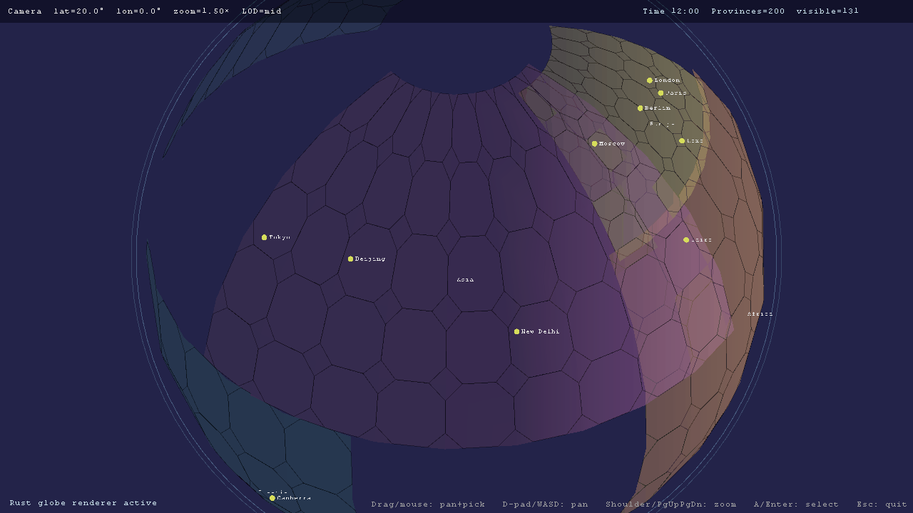 | `cargo run -- content/games/showcase/globe_demo` |
| [Hacking Game](./showcase/hacking_game) | `showcase` | `KEEP` | unspecified; smoke:PASS | `automation`, `camera`, `event`, `input`, `particle`, `render`, `textinput`, +3 | 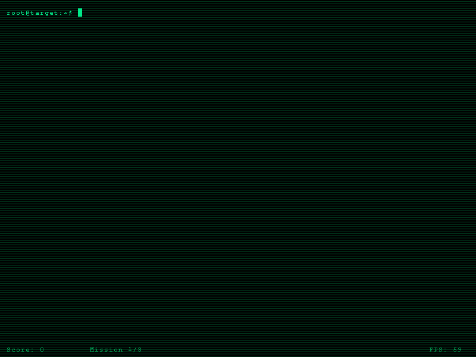 | `cargo run -- content/games/showcase/hacking_game` |

## Rewrite Or Trim Queue

| Demo | Type | Decision | Status | APIs | Preview | Run |
|---|---|---|---|---|---|---|
| [Donkey Kong](./arcade/donkey_kong) | `arcade` | `REWRITE_API` | unspecified; smoke:PASS | `automation`, `camera`, `event`, `input`, `particle`, `render`, `timer`, +3 | 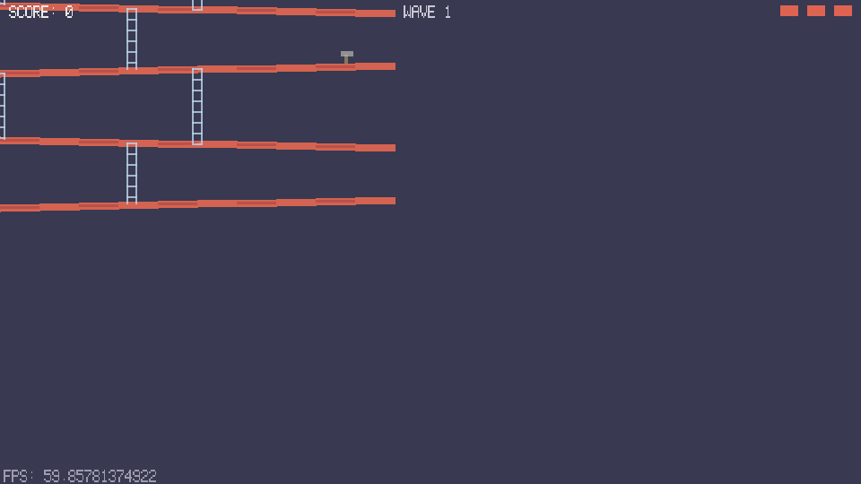 | `cargo run -- content/games/arcade/donkey_kong` |
| [Galaga](./arcade/galaga) | `arcade` | `REWRITE_API` | unspecified; smoke:PASS | `ai`, `automation`, `camera`, `ecs`, `event`, `input`, `particle`, +5 | 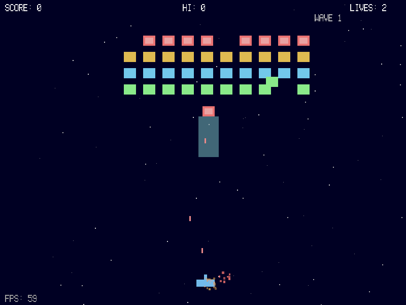 | `cargo run -- content/games/arcade/galaga` |
| [Fighting Game](./action/fighting_game) | `action` | `TRIM` | unspecified; smoke:PASS | `automation`, `camera`, `event`, `input`, `particle`, `render`, `timer`, +3 | 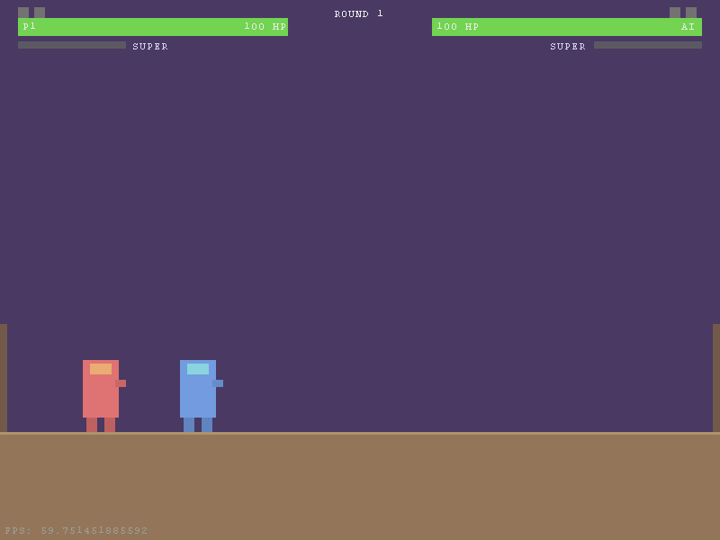 | `cargo run -- content/games/action/fighting_game` |
| [Metroidvania](./action/metroidvania) | `action` | `REWRITE_API` | unspecified; smoke:NO_IMAGE; known-failing:content-demo-maintainers (exited cleanly but no PNG written) | `automation`, `event`, `input`, `particle`, `render`, `timer`, `ui`, +1 | 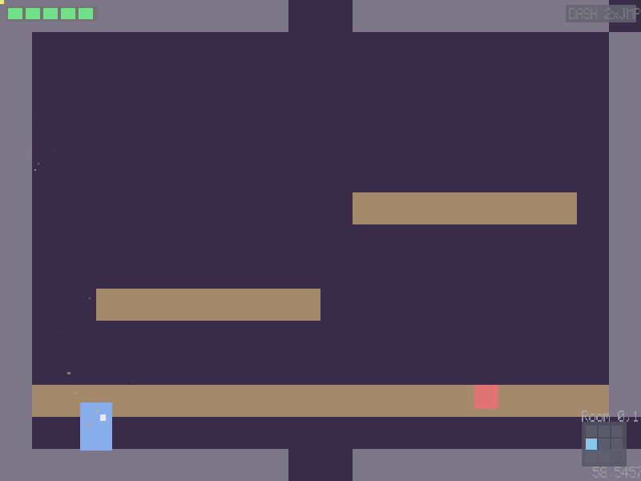 | `cargo run -- content/games/action/metroidvania` |
| [Platform Fighter](./action/platform_fighter) | `action` | `TRIM` | unspecified; smoke:PASS | `automation`, `event`, `input`, `particle`, `render`, `timer`, `ui`, +1 | 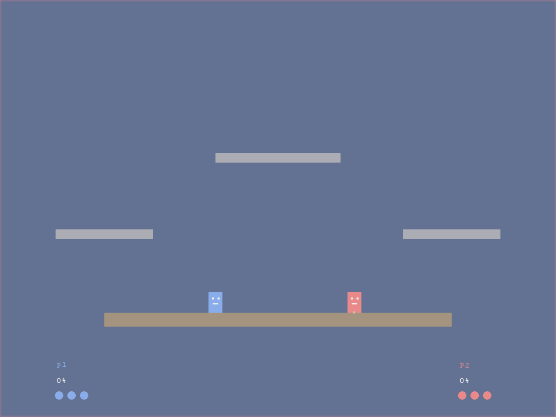 | `cargo run -- content/games/action/platform_fighter` |
| [Platformer](./action/platformer) | `action` | `REWRITE_API` | unspecified; smoke:PASS | `automation`, `event`, `input`, `particle`, `render`, `timer`, `tween`, +2 | 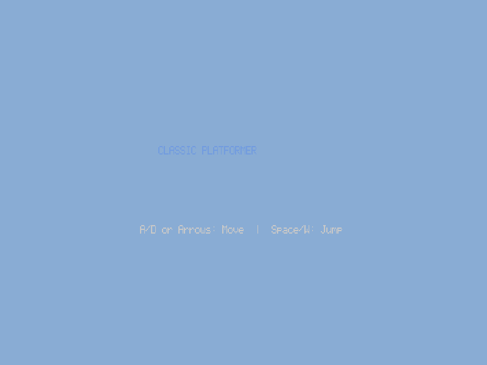 | `cargo run -- content/games/action/platformer` |
| [Roguelite](./action/roguelite) | `action` | `TRIM` | unspecified; smoke:NO_IMAGE; known-failing:content-demo-maintainers (exited cleanly but no PNG written) | `automation`, `camera`, `event`, `input`, `particle`, `ready`, `render`, +4 | 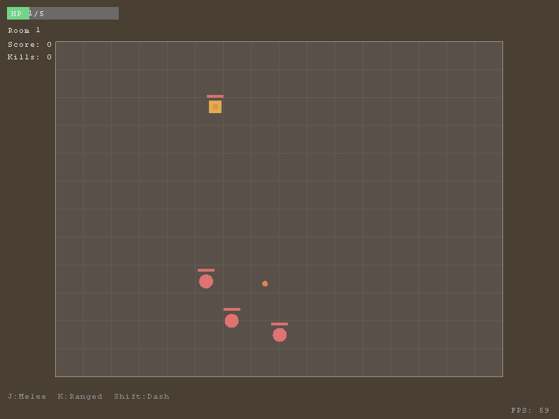 | `cargo run -- content/games/action/roguelite` |
| [Soulslike](./action/soulslike) | `action` | `TRIM` | unspecified; smoke:PASS | `automation`, `camera`, `event`, `input`, `particle`, `render`, `timer`, +3 | 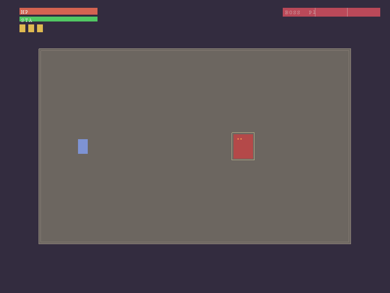 | `cargo run -- content/games/action/soulslike` |
| [Stealth Ops](./action/stealth_ops) | `action` | `REWRITE_API` | playable foundation; smoke:PASS | `ai`, `event`, `input`, `light`, `pathfind`, `render`, `tilemap`, +2 | 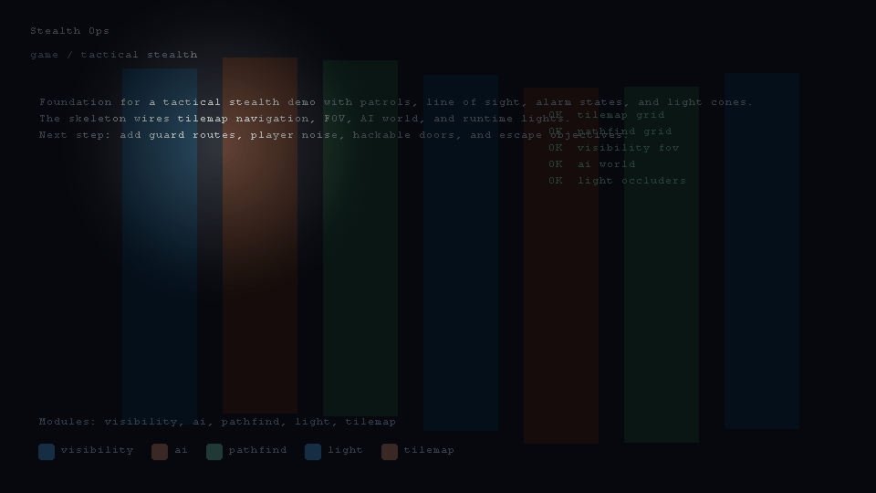 | `cargo run -- content/games/action/stealth_ops` |
| [Creature Collector](./rpg/creature_collector) | `rpg` | `TRIM` | unspecified; smoke:PASS | `automation`, `camera`, `event`, `input`, `render`, `timer`, `window` | 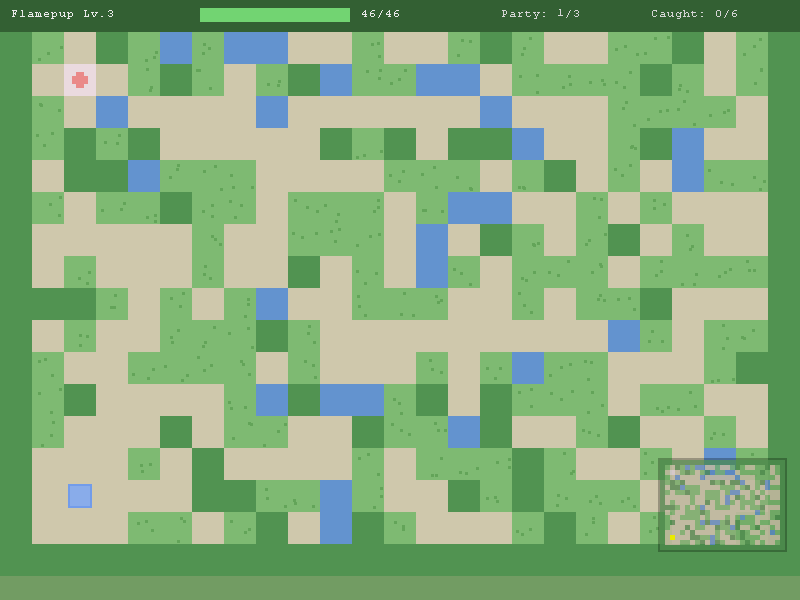 | `cargo run -- content/games/rpg/creature_collector` |
| [Horror](./rpg/horror) | `rpg` | `TRIM` | unspecified; smoke:PASS | `automation`, `camera`, `event`, `input`, `particle`, `render`, `timer`, +2 | 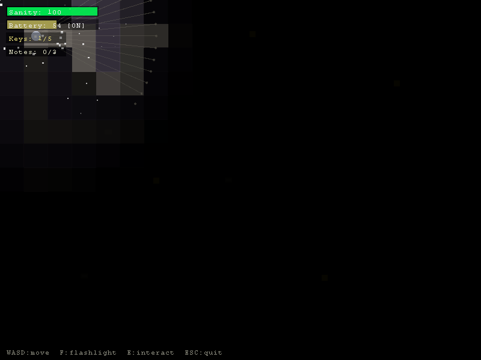 | `cargo run -- content/games/rpg/horror` |
| [Modded Arena](./rpg/modded_arena) | `rpg` | `REWRITE_API` | skeleton; smoke:PASS | `asset`, `dialog`, `event`, `filesystem`, `input`, `mods`, `render`, +2 | 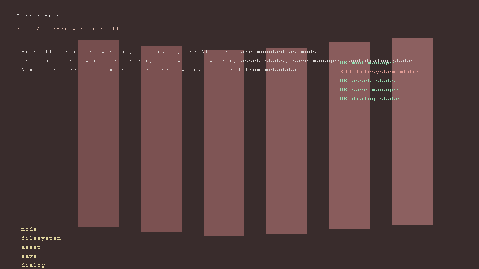 | `cargo run -- content/games/rpg/modded_arena` |
| [Social Deduction](./rpg/social_deduction) | `rpg` | `TRIM` | unspecified; smoke:NO_IMAGE; known-failing:content-demo-maintainers (exited cleanly but no PNG written) | `automation`, `camera`, `event`, `input`, `render`, `tween`, `window` | 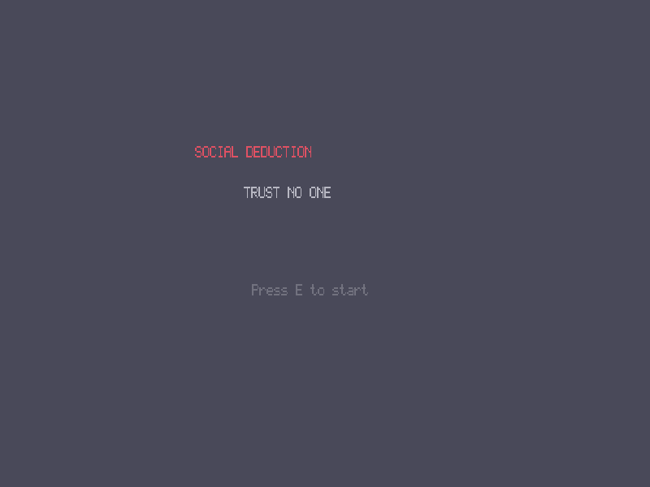 | `cargo run -- content/games/rpg/social_deduction` |
| [Star Voyage](./rpg/star_voyage) | `rpg` | `TRIM` | unspecified; smoke:NO_IMAGE; known-failing:content-demo-maintainers (exited cleanly but no PNG written) | `automation`, `event`, `input`, `math`, `render`, `window` | 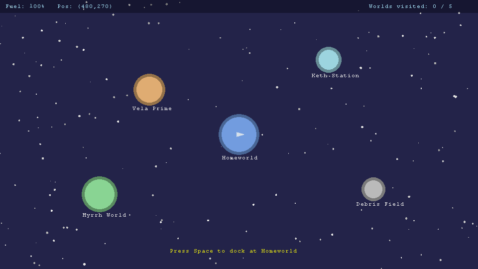 | `cargo run -- content/games/rpg/star_voyage` |
| [Survival Crafting](./rpg/survival_crafting) | `rpg` | `TRIM` | unspecified; smoke:PASS | `automation`, `camera`, `event`, `input`, `render`, `timer`, `window` | 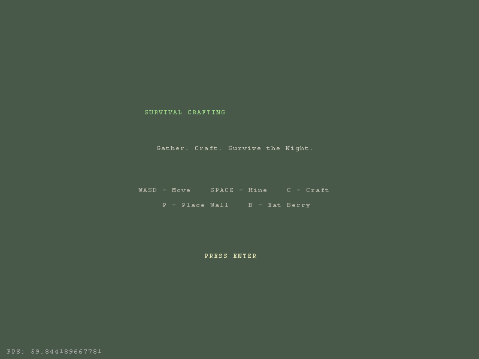 | `cargo run -- content/games/rpg/survival_crafting` |
| [Dune2 Like](./strategy/dune2_like) | `strategy` | `REWRITE_API` | unspecified; smoke:PASS | `event`, `input`, `render`, `window` | 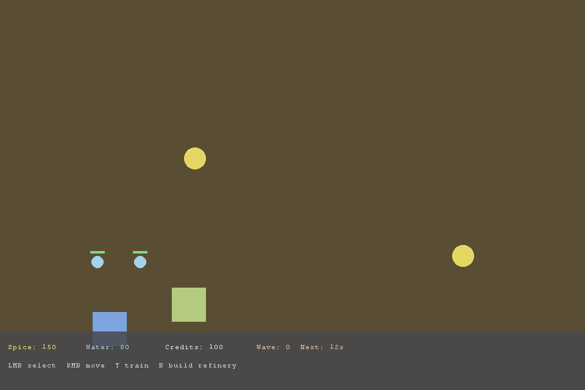 | `cargo run -- content/games/strategy/dune2_like` |
| [Eu2](./strategy/eu2) | `strategy` | `TRIM` | unspecified; smoke:PASS | `automation`, `event`, `filesystem`, `image`, `input`, `log`, `minimap`, +4 | 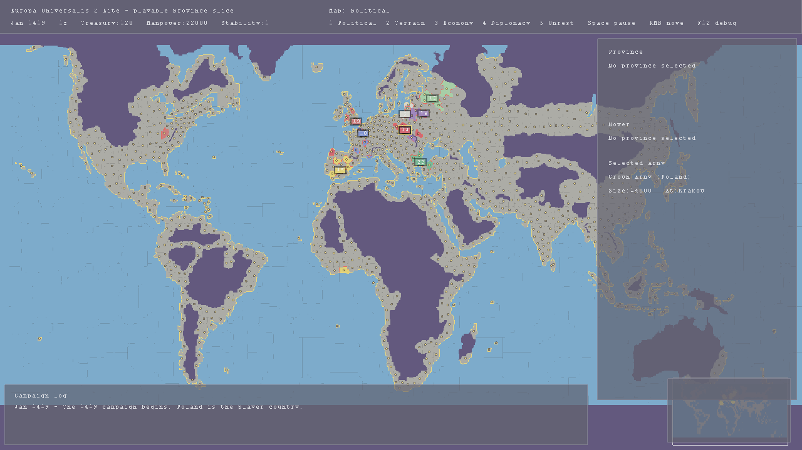 | `cargo run -- content/games/strategy/eu2` |
| [Party Games](./strategy/party_games) | `strategy` | `TRIM` | unspecified; smoke:PASS | `automation`, `event`, `input`, `particle`, `render`, `window` | 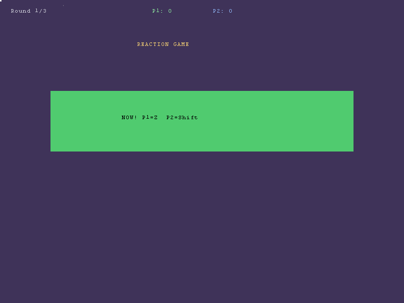 | `cargo run -- content/games/strategy/party_games` |
| [Rts](./strategy/rts) | `strategy` | `TRIM` | unspecified; smoke:PASS | `automation`, `event`, `input`, `particle`, `render`, `window` | 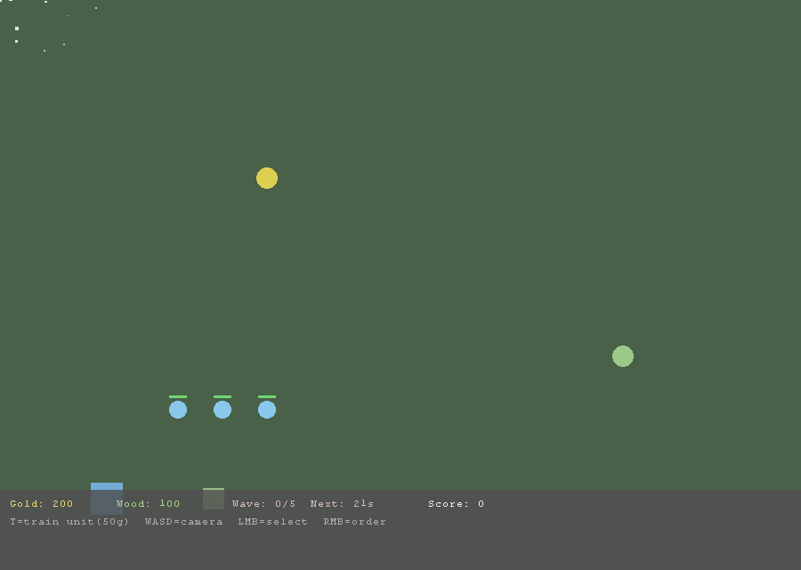 | `cargo run -- content/games/strategy/rts` |
| [Wargame](./strategy/wargame) | `strategy` | `TRIM` | unspecified; smoke:PASS | `automation`, `event`, `input`, `particle`, `render`, `window` | 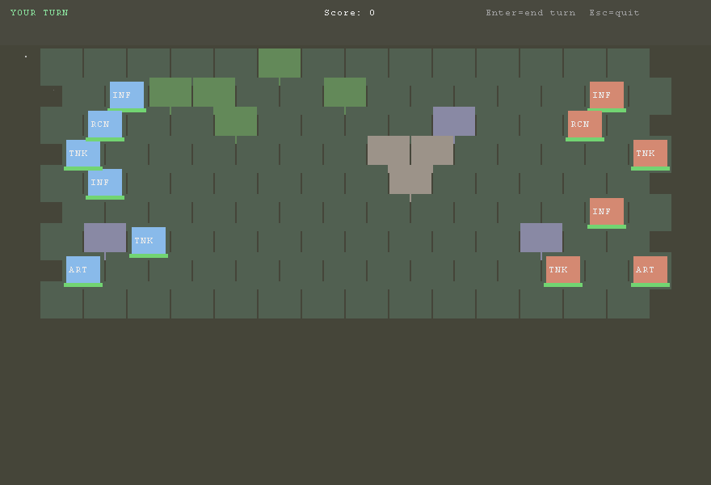 | `cargo run -- content/games/strategy/wargame` |
| [Worms Artillery](./strategy/worms_artillery) | `strategy` | `REWRITE_API` | unspecified; smoke:PASS | `automation`, `event`, `input`, `math`, `particle`, `procgen`, `render`, +1 | 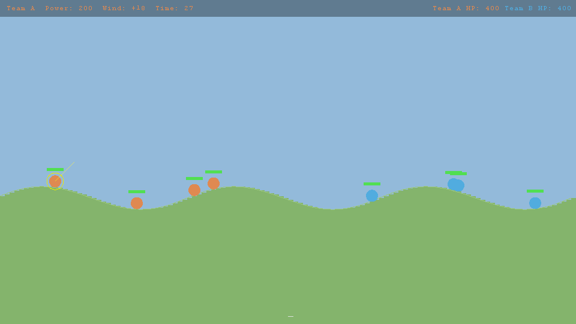 | `cargo run -- content/games/strategy/worms_artillery` |
| [Colony Sim](./simulation/colony_sim) | `simulation` | `TRIM` | unspecified; smoke:PASS | `automation`, `event`, `input`, `render`, `timer`, `window` | 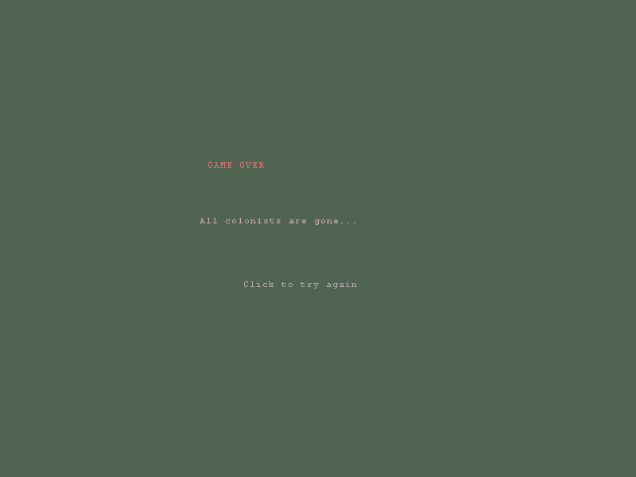 | `cargo run -- content/games/simulation/colony_sim` |
| [Farming Sim](./simulation/farming_sim) | `simulation` | `TRIM` | - **Soil Tilling:** Use the **Hoe** tool to turn dry earth into fertile soil; smoke:PASS | `automation`, `camera`, `event`, `input`, `particle`, `render`, `timer`, +2 | 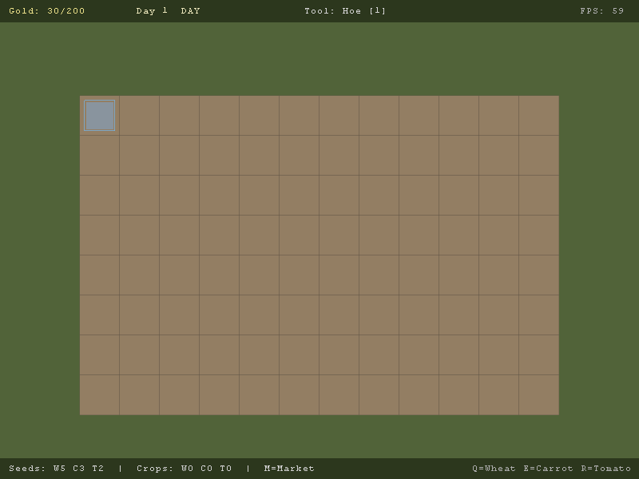 | `cargo run -- content/games/simulation/farming_sim` |
| [God Game](./simulation/god_game) | `simulation` | `TRIM` | unspecified; smoke:PASS | `automation`, `event`, `input`, `render`, `timer`, `window` | 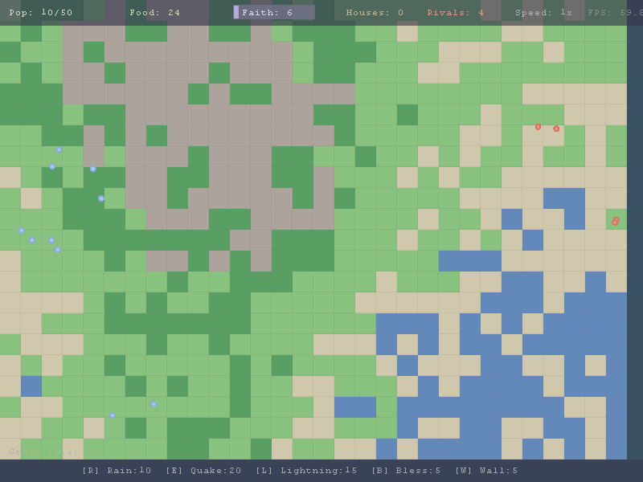 | `cargo run -- content/games/simulation/god_game` |
| [Hotel Manager](./simulation/hotel_manager) | `simulation` | `TRIM` | unspecified; smoke:PASS | `automation`, `camera`, `event`, `input`, `render`, `timer`, `window` | 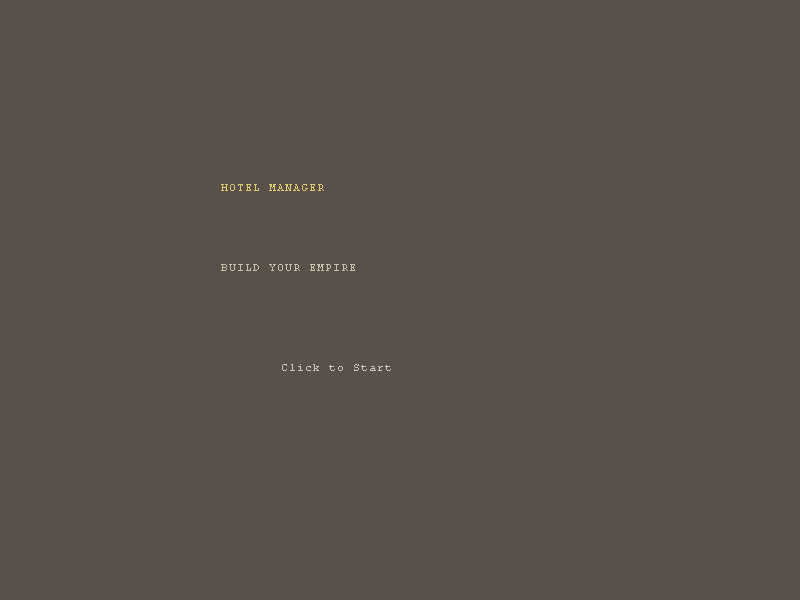 | `cargo run -- content/games/simulation/hotel_manager` |
| [Medical Sim](./simulation/medical_sim) | `simulation` | `TRIM` | unspecified; smoke:NO_IMAGE; known-failing:content-demo-maintainers (exited cleanly but no PNG written) | `automation`, `camera`, `event`, `input`, `render`, `timer`, `window` | 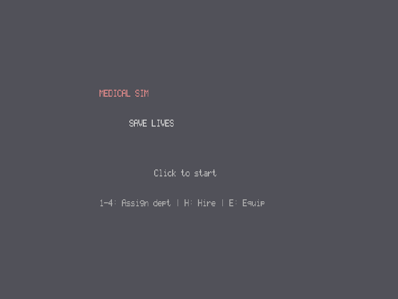 | `cargo run -- content/games/simulation/medical_sim` |
| [Rail Flow Tycoon](./simulation/rail_flow_tycoon) | `simulation` | `TRIM` | playable foundation; smoke:PASS | `charts`, `event`, `graph`, `input`, `pathfind`, `render`, `save`, +2 | 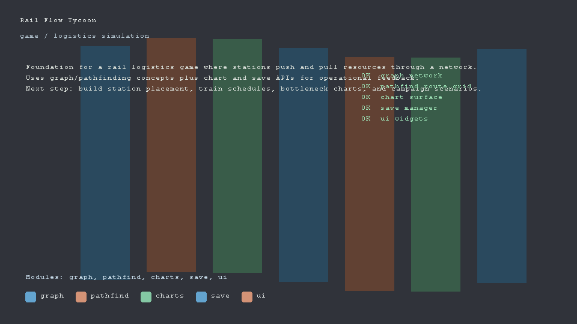 | `cargo run -- content/games/simulation/rail_flow_tycoon` |
| [Railroad](./simulation/railroad) | `simulation` | `TRIM` | unspecified; smoke:PASS | `automation`, `camera`, `event`, `input`, `render`, `timer`, `window` | 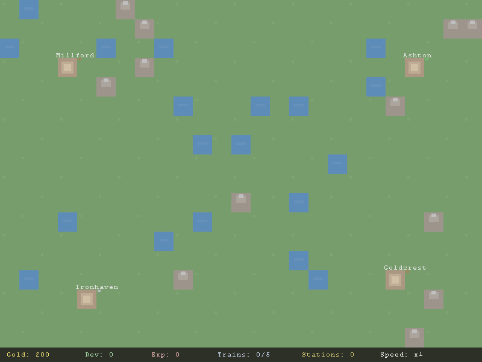 | `cargo run -- content/games/simulation/railroad` |
| [Settlers Rise](./simulation/settlers_rise) | `simulation` | `TRIM` | unspecified; smoke:PASS | `automation`, `event`, `input`, `math`, `pathfind`, `procgen`, `render`, +1 | 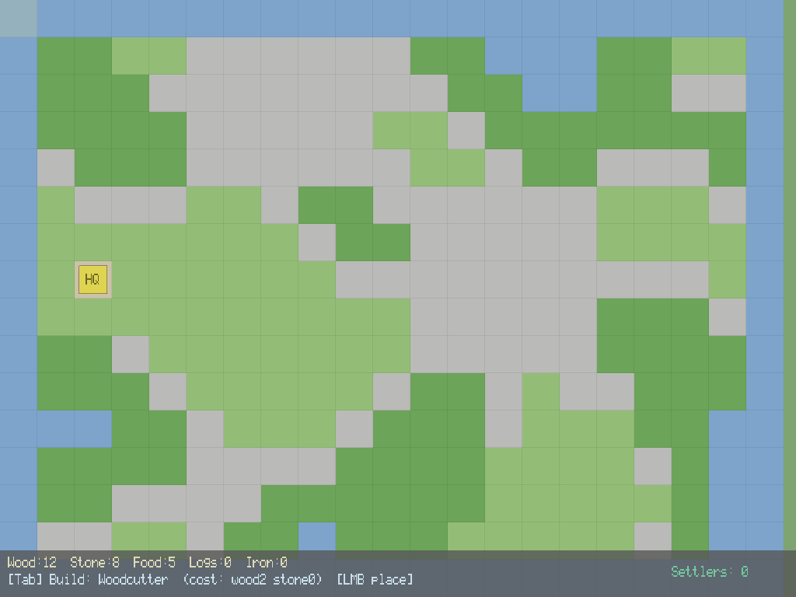 | `cargo run -- content/games/simulation/settlers_rise` |
| [Tower Sim](./simulation/tower_sim) | `simulation` | `TRIM` | unspecified; smoke:PASS | `automation`, `event`, `input`, `render`, `timer`, `window` | 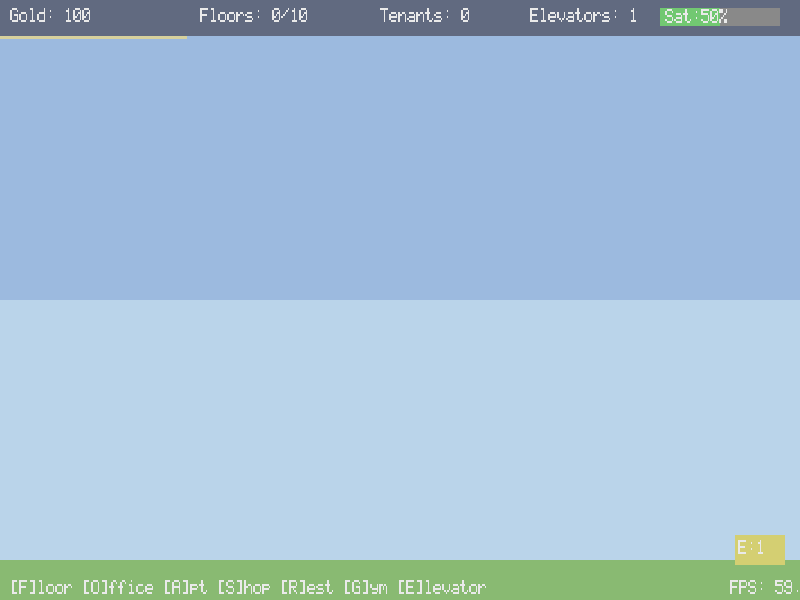 | `cargo run -- content/games/simulation/tower_sim` |
| [Tycoon](./simulation/tycoon) | `simulation` | `TRIM` | unspecified; smoke:PASS | `automation`, `camera`, `event`, `input`, `render`, `timer`, `window` | 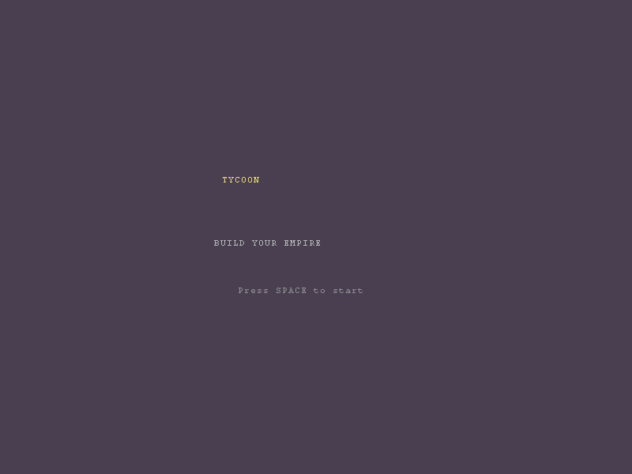 | `cargo run -- content/games/simulation/tycoon` |
| [Vehicle Builder](./simulation/vehicle_builder) | `simulation` | `TRIM` | unspecified; smoke:PASS | `automation`, `event`, `input`, `render`, `timer`, `window` | 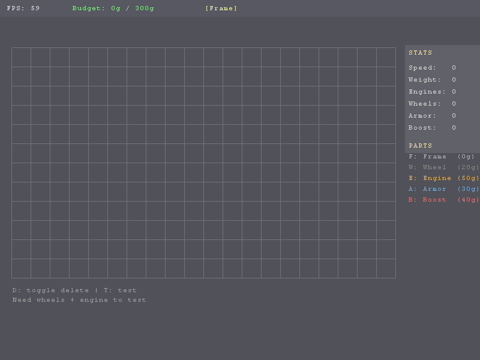 | `cargo run -- content/games/simulation/vehicle_builder` |
| [Zoo Tycoon](./simulation/zoo_tycoon) | `simulation` | `TRIM` | unspecified; smoke:PASS | `automation`, `camera`, `event`, `input`, `render`, `timer`, `window` | 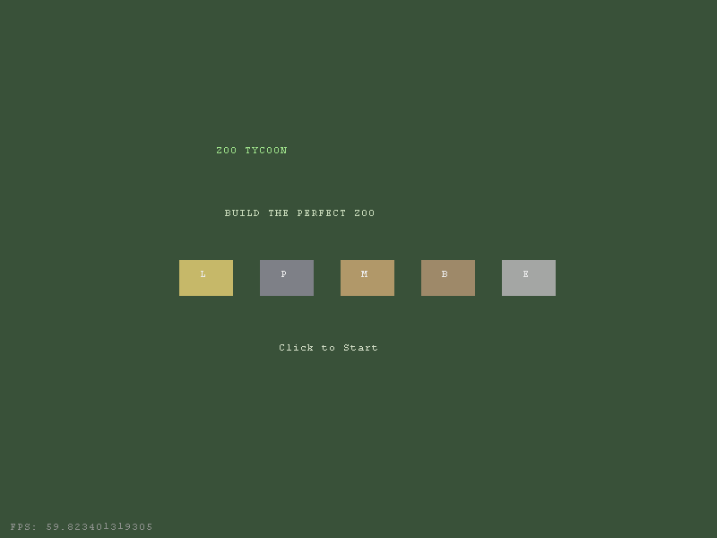 | `cargo run -- content/games/simulation/zoo_tycoon` |
| [Sensible Soccer](./sports/sensible_soccer) | `sports` | `REWRITE_API` | unspecified; smoke:NO_IMAGE; known-failing:content-demo-maintainers (exited cleanly but no PNG written) | `automation`, `event`, `input`, `render`, `ui`, `window` | 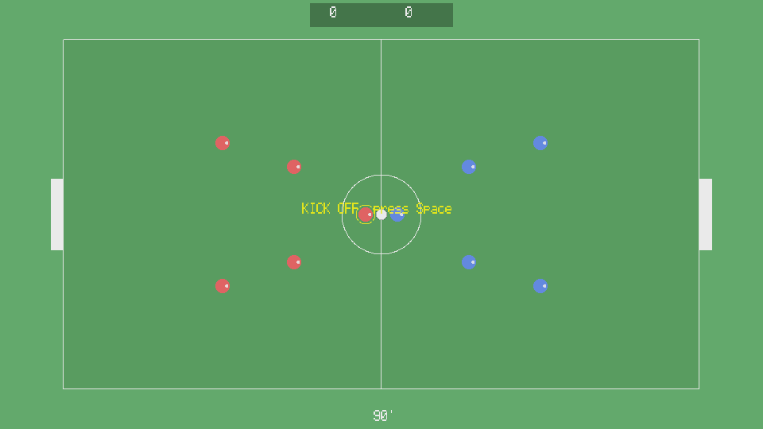 | `cargo run -- content/games/sports/sensible_soccer` |
| [Sports Manager](./sports/sports_manager) | `sports` | `TRIM` | unspecified; smoke:NO_IMAGE; known-failing:content-demo-maintainers (exited cleanly but no PNG written) | `automation`, `event`, `input`, `render`, `timer`, `ui`, `window` | 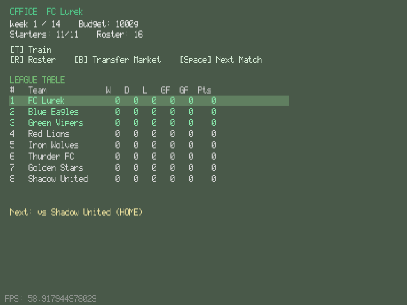 | `cargo run -- content/games/sports/sports_manager` |
| [Household Finance Lab](./apps/household_finance_lab) | `apps` | `TRIM` | unspecified; smoke:NO_IMAGE; known-failing:content-demo-maintainers (exited cleanly but no PNG written) | `binary`, `charts`, `dataframe`, `engine`, `filesystem`, `image`, `math`, +6 | 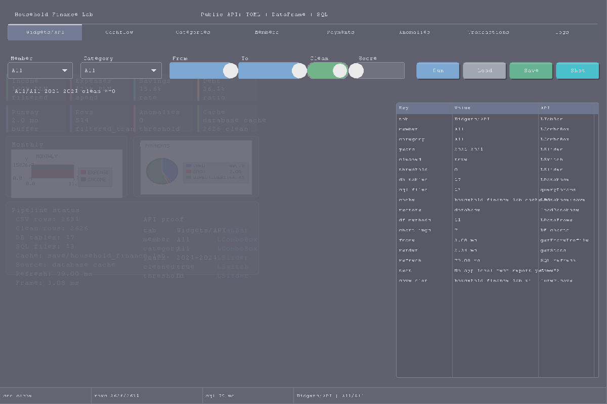 | `cargo run -- content/games/apps/household_finance_lab` |
| [Another World](./retro/another_world) | `retro` | `TRIM` | unspecified; smoke:PASS | `automation`, `camera`, `event`, `input`, `render`, `timer`, `ui`, +1 | 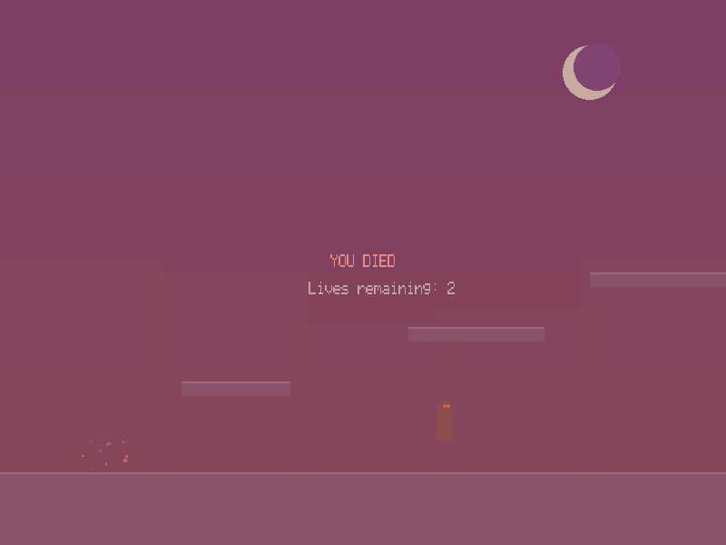 | `cargo run -- content/games/retro/another_world` |
| [Boulder Dash](./retro/boulder_dash) | `retro` | `REWRITE_API` | unspecified; smoke:NO_IMAGE; known-failing:content-demo-maintainers (exited cleanly but no PNG written) | `automation`, `event`, `input`, `render`, `timer`, `ui`, `window` | 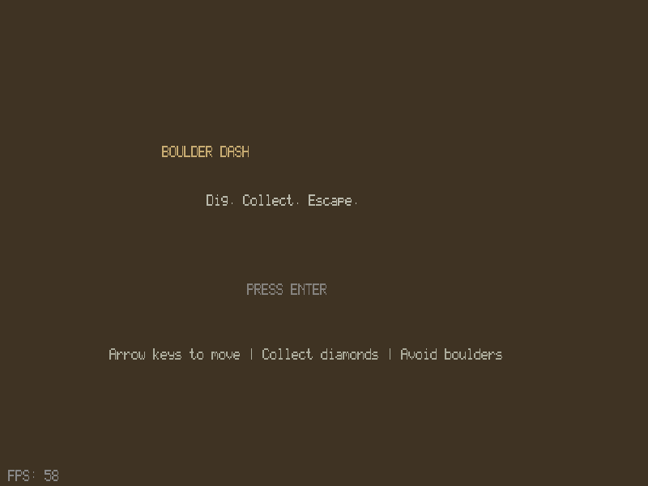 | `cargo run -- content/games/retro/boulder_dash` |
| [Dungeon Crawler](./retro/dungeon_crawler) | `retro` | `REWRITE_API` | unspecified; smoke:NO_IMAGE; known-failing:content-demo-maintainers (exited cleanly but no PNG written) | `automation`, `event`, `input`, `raycaster`, `render`, `timer`, `ui`, +1 |  | `cargo run -- content/games/retro/dungeon_crawler` |
| [Giana Sisters](./retro/giana_sisters) | `retro` | `REWRITE_API` | unspecified; smoke:PASS | `automation`, `event`, `input`, `render`, `timer`, `ui`, `window` | 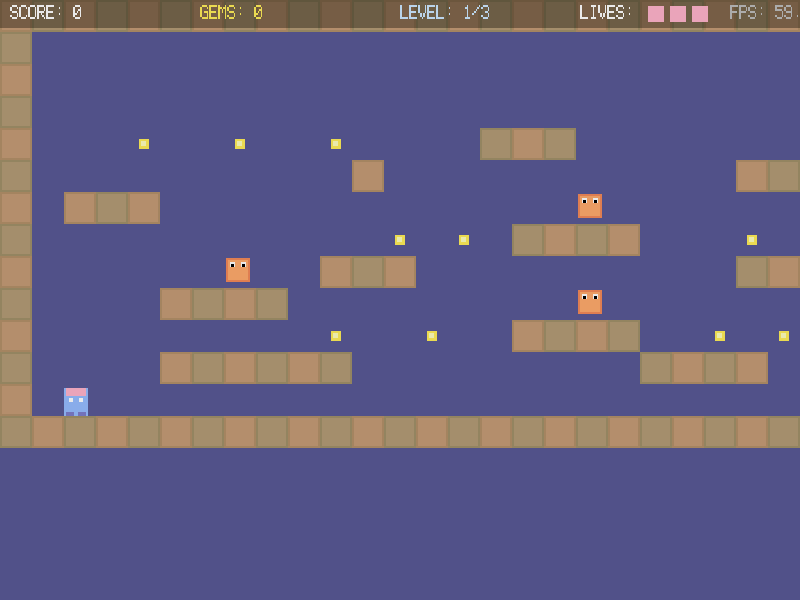 | `cargo run -- content/games/retro/giana_sisters` |
| [Lemmings](./retro/lemmings) | `retro` | `TRIM` | unspecified; smoke:PASS | `automation`, `event`, `input`, `render`, `timer`, `ui`, `window` | 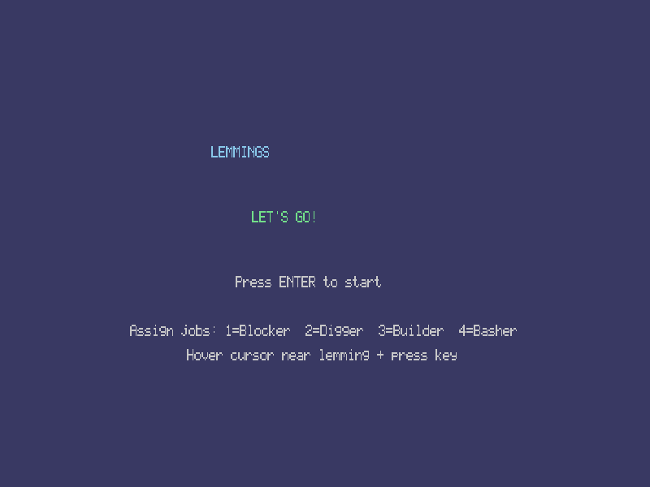 | `cargo run -- content/games/retro/lemmings` |
| [Paradroid](./retro/paradroid) | `retro` | `TRIM` | unspecified; smoke:PASS | `automation`, `event`, `input`, `particle`, `render`, `tween`, `ui`, +1 | 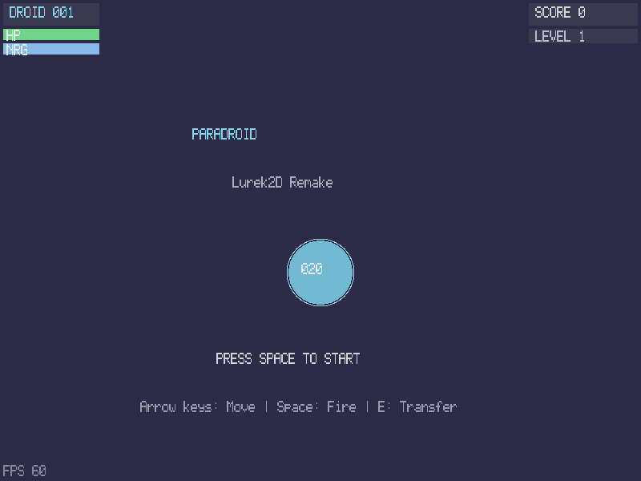 | `cargo run -- content/games/retro/paradroid` |
| [Shadow Beast](./retro/shadow_beast) | `retro` | `TRIM` | unspecified; smoke:NO_IMAGE; known-failing:content-demo-maintainers (exited cleanly but no PNG written) | `automation`, `camera`, `event`, `input`, `render`, `timer`, `ui`, +1 | 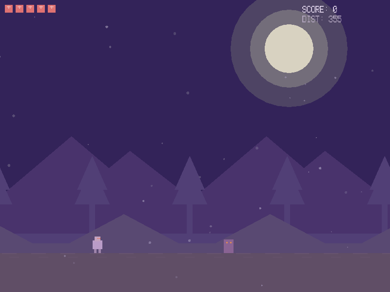 | `cargo run -- content/games/retro/shadow_beast` |
| [Turrican](./retro/turrican) | `retro` | `TRIM` | unspecified; smoke:NO_IMAGE; known-failing:content-demo-maintainers (exited cleanly but no PNG written) | `automation`, `camera`, `event`, `input`, `particle`, `render`, `timer`, +3 | 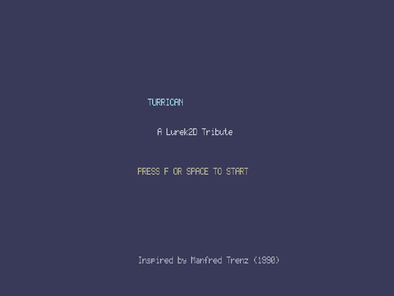 | `cargo run -- content/games/retro/turrican` |
