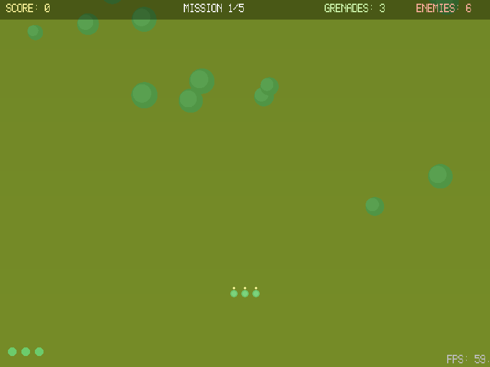
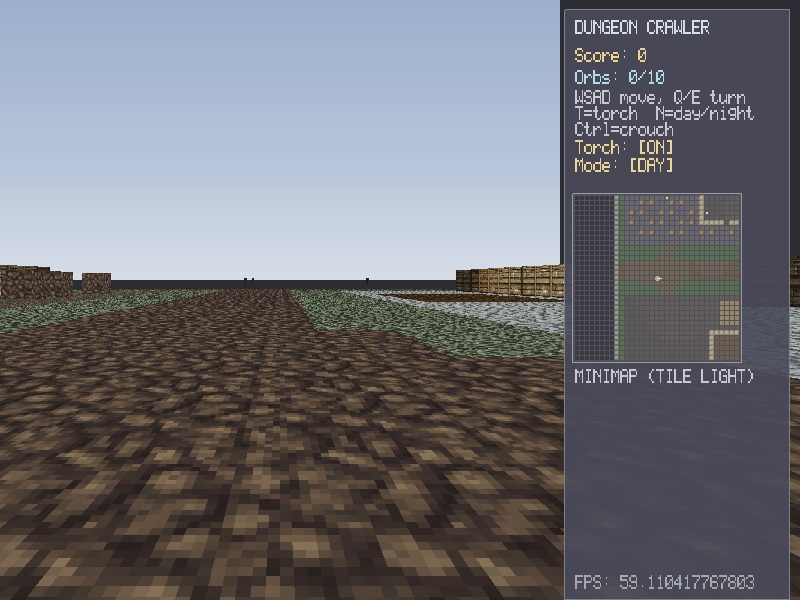
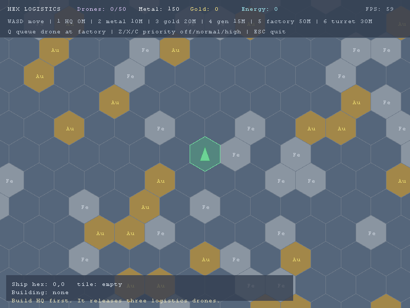
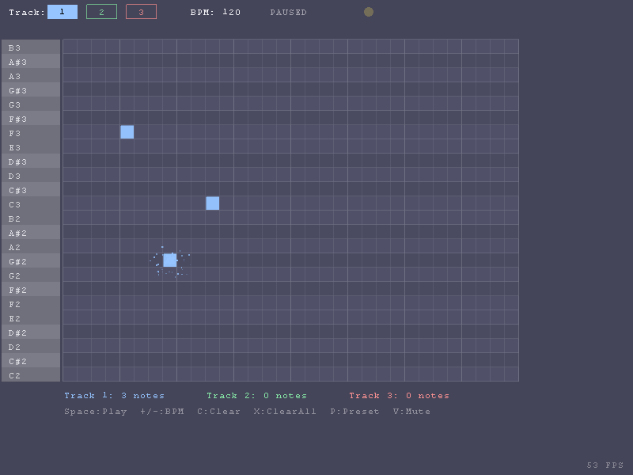
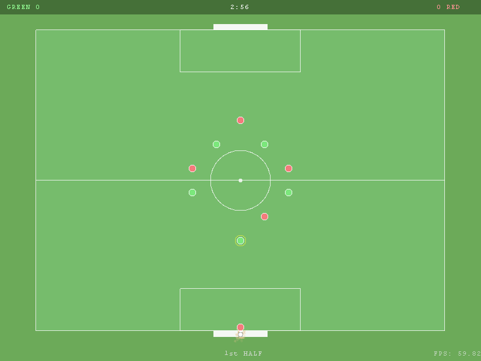

# Lurek2D Demo Catalog

This catalog is generated from runnable `content/games/<name>` folders and the current product decisions.
It lists only finished catalog candidates. Showcase-like entries, migration targets, and backlog cleanup stay out of this public catalog.

## Run

```powershell
cargo run -- content/games/<name>
python tools/demos/audit_games.py
python tools/demos/gen_demo_catalog.py
```

## Status Rules

- Only `KEEP` rows appear here.
- Each row should declare `Scale: game` or `Scale: minigame` in its local README.
- `REWRITE_API`, `TRIM`, and migration decisions stay in `work/games-audit.md` and `work/games-audit.json` until they are cleaned up.

## Catalog Candidates

| Demo | Type | Scale | Decision | Status | APIs | Preview | Run |
|---|---|---|---|---|---|---|---|
| [Cannon Fodder](./cannon_fodder) | `games` | `unspecified` | `KEEP` | unspecified; validate:not-run; gif:missing | `automation`, `event`, `input`, `render`, `timer`, `ui`, `window` | <br>`preview.gif missing` | `cargo run -- content/games/cannon_fodder` |
| [Dungeon Crawler](./dungeon_crawler) | `games` | `unspecified` | `KEEP` | unspecified; validate:not-run | `automation`, `event`, `input`, `raycaster`, `render`, `timer`, `ui`, +1 |  | `cargo run -- content/games/dungeon_crawler` |
| [Europa Universalis 2 Lite](./eu2) | `games` | `unspecified` | `KEEP` | unspecified; validate:not-run | `automation`, `event`, `filesystem`, `image`, `input`, `log`, `minimap`, +4 |  | `cargo run -- content/games/eu2` |
| [Household Finance Lab](./finance_app) | `games` | `unspecified` | `KEEP` | unspecified; validate:not-run | `charts`, `dataframe`, `engine`, `filesystem`, `image`, `math`, `render`, +5 |  | `cargo run -- content/games/finance_app` |
| [Hex Logistics](./hex_logistics) | `games` | `unspecified` | `KEEP` | unspecified; validate:not-run | `automation`, `event`, `input`, `math`, `render`, `tilemap`, `timer`, +1 |  | `cargo run -- content/games/hex_logistics` |
| [Music Composer](./music_composer) | `games` | `unspecified` | `KEEP` | unspecified; validate:not-run; gif:missing | `automation`, `camera`, `event`, `input`, `particle`, `render`, `timer`, +1 | <br>`preview.gif missing` | `cargo run -- content/games/music_composer` |
| [Sensible Soccer](./sensible_soccer) | `games` | `unspecified` | `KEEP` | unspecified; validate:not-run; gif:missing | `automation`, `event`, `input`, `render`, `timer`, `ui`, `window` | <br>`preview.gif missing` | `cargo run -- content/games/sensible_soccer` |
