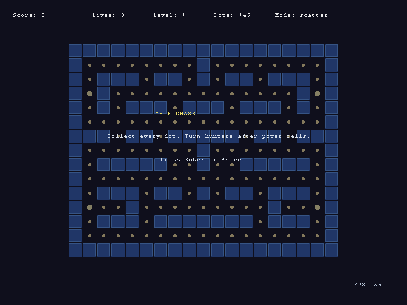

# Maze Chase

Maze Chase is an original grid-based chase game built on current Lurek2D APIs.
Guide the runner through a compact maze, collect every dot, trigger power cells,
and use timed route changes to survive three pathfinding hunters.

**Status:** playable rewrite
**Category:** arcade
**Run:** `cargo run -- content/games/arcade/pac_man`

## Gameplay Loop

1. Press Enter or Space to start.
2. Queue turns with directional actions before intersections.
3. Collect dots for score and power cells to reverse the chase.
4. Hunters alternate between scatter and chase modes.
5. Clear all dots to advance to the next faster maze.

## Controls

| Input | Action |
|---|---|
| `W` / `Up` | Queue up |
| `S` / `Down` | Queue down |
| `A` / `Left` | Queue left |
| `D` / `Right` | Queue right |
| `Enter` / `Space` | Start |
| `R` | Restart after game over |
| `Escape` | Quit |

## APIs Used

- `lurek.input` for action bindings and queued movement.
- `lurek.render` for maze tiles, dots, runner, hunters, and overlay text.
- `lurek.timer` for FPS display and pulse timing.
- `lurek.particle` for dot and hunter-tag feedback.
- `lurek.automation` for smoke replay compatibility.
- `lurek.window` and `lurek.event` for window lifecycle and quit handling.

The hunter behavior is implemented as local Lua BFS over the maze grid. It is
intentionally kept in this demo so the pathfinding logic stays readable.

## Preview



## Validation

```powershell
python tools/validate/validate_game.py content/games/arcade/pac_man
python tools/demos/smoke_sweep.py --kind game --only arcade/pac_man --frames 300
```
