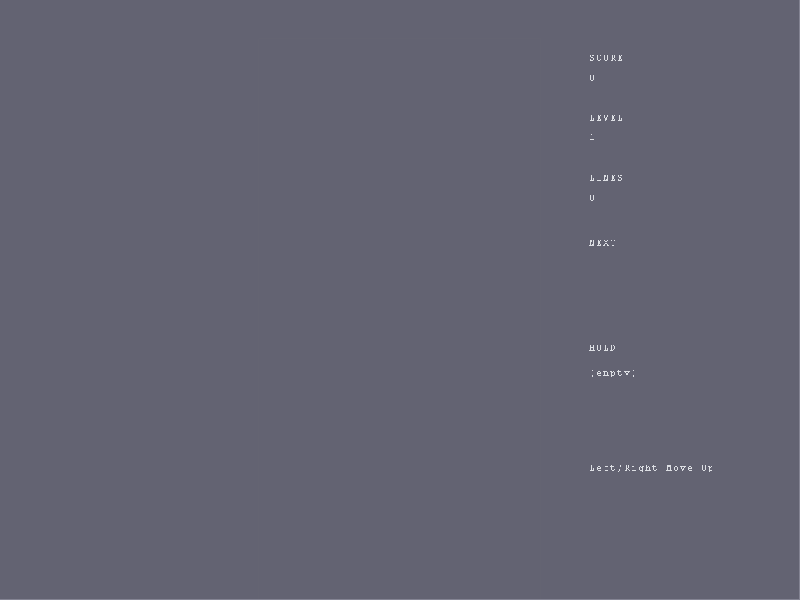

# Falling Blocks

**Status:** playable rewrite
**Category:** arcade
**Run:** `cargo run -- content/games/arcade/tetris`

Falling Blocks is an original falling-block puzzle demo built on current
Lurek2D APIs. Rotate, hold, preview, and hard-drop colored block sets into a
10 by 20 board, clear full rows, and survive as the drop speed increases.

## Gameplay Loop

1. Press Enter to start from the title screen.
2. Move and rotate the active block set as it falls.
3. Use the ghost preview to plan the landing point.
4. Clear rows to score, raise the level, and trigger particle feedback.
5. Use hold once per drop to save a useful block set for later.

## Controls

| Input | Action |
|---|---|
| `A` / `Left` | Move left |
| `D` / `Right` | Move right |
| `W` / `Up` | Rotate |
| `S` / `Down` | Soft drop |
| `Space` | Hard drop |
| `C` | Hold or swap block set |
| `Enter` | Start |
| `R` | Restart after game over |
| `Escape` | Quit |

## APIs Used

- `lurek.input` for action bindings and press/down state.
- `lurek.render` for board, cells, ghost preview, and flash overlays.
- `lurek.ui` for title, HUD, and game-over layout.
- `lurek.particle` for row-clear spark effects.
- `lurek.tween` for flash and shake falloff.
- `lurek.timer` for FPS and time-based shake.
- `lurek.automation` for smoke replay compatibility.

## Preview



## Validation

```powershell
python tools/validate/validate_game.py content/games/arcade/tetris
python tools/demos/smoke_sweep.py --kind game --only arcade/tetris --frames 300
```
