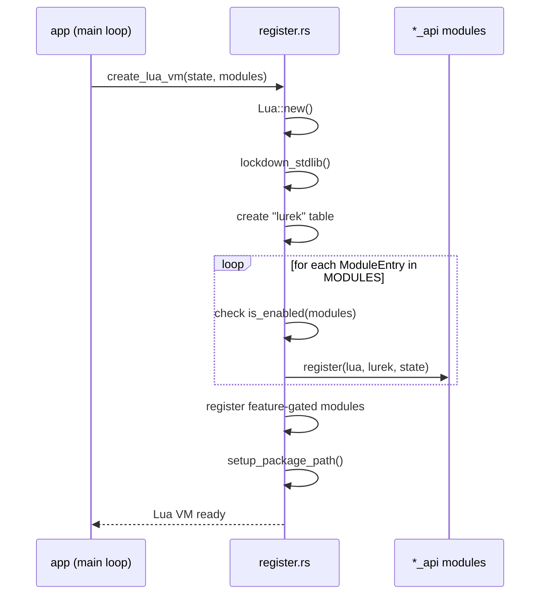

# Lua–Rust Boundary Architecture

## TL;DR

Defines how the Rust engine exposes functionality to Lua scripts: module registration, state management, the handle pattern, security sandbox, and testing strategy.

Companion documents: [engine-architecture.md](engine-architecture.md) · [philosophy.md](philosophy.md) · [test-framework.md](test-framework.md)

---

## Table of Contents

1. [Overview](#overview)
2. [Module Registration](#module-registration)
3. [State Management](#state-management)
4. [Security Sandbox](#security-sandbox)
5. [Handle Pattern](#handle-pattern)
6. [Package Path Resolution](#package-path-resolution)
7. [Testing Strategy](#testing-strategy)
8. [Future Direction](#future-direction)

---

## Overview

`src/lua_api/` lives in the **Edge/Integration** layer — the top of the module DAG. It is the sole bridge between Lua game scripts and the Rust engine. No other layer may import `mlua` types.

The boundary is **one-directional**: Rust calls into Lua (callbacks), and Lua calls into Rust (API functions). Lua never directly accesses Rust memory; Rust never directly accesses Lua internals outside `mlua`.

Key binding constraints (from [philosophy.md](philosophy.md)):

| Rule | Statement |
|------|-----------|
| B-01 | LuaJIT via `mlua 0.9` is the main runtime; `lua54` is a CI-only fallback. |
| TST-03 | `src/lua_api/<module>_api.rs` contains bindings only. Business logic stays in `src/<module>/`. |
| TST-04 | `mod.rs` files contain only `pub mod`, `pub use`, attributes, and doc comments. |
| Zen 12 | Lua bindings are thin and one-directional. |

---

## Module Registration

### The `LuaModule` Trait

Each API module can implement `LuaModule` (defined in `src/lua_api/lua_module.rs`):

```rust
pub trait LuaModule {
    const MODULE_NAME: &'static str;
    fn is_enabled(modules: &ModulesConfig) -> bool;
    fn register(lua: &Lua, lurek: &LuaTable, state: Rc<RefCell<SharedState>>) -> LuaResult<()>;
}
```

`MODULE_NAME` matches the `lurek.*` namespace for diagnostics. `is_enabled` decides whether the module loads for a given configuration. `register` installs functions and types into the `lurek` table.

### `ModuleEntry` and the Static Registry

Because associated constants prevent `dyn LuaModule`, registration uses a data-driven approach:

```rust
pub struct ModuleEntry {
    pub name: &'static str,
    pub is_enabled: fn(&ModulesConfig) -> bool,
    pub register: fn(&Lua, &LuaTable, Rc<RefCell<SharedState>>) -> LuaResult<()>,
}
```

A static `MODULES` slice in `src/lua_api/register.rs` holds all standard modules, constructed via two macros:

| Macro | Use case | Example |
|-------|----------|---------|
| `always!(api)` | Module always loads | `always!(event_api)` |
| `gated!(api, field)` | Module loads when `ModulesConfig.field` is `true` | `gated!(physics_api, physics)` |

### Feature-Gated Modules

Modules behind Cargo features (`automation-plugin`, `devtools-plugin`, `graph`, `ui-charts`) cannot appear in the static slice because `#[cfg]` is a compile-time decision. These are registered separately after the slice iteration:

```rust
#[cfg(feature = "devtools-plugin")]
if modules.debug {
    devtools_api::register(lua, lurek, state.clone())?;
}
```

### Registration Flow



---

## State Management

### `SharedState`

All engine subsystems share a single `SharedState` instance, threaded through the boundary as:

```rust
Rc<RefCell<SharedState>>
```

**Why `Rc<RefCell<_>>`?** LuaJIT is single-threaded. The engine runs one Lua VM per thread. Within a single thread, `Rc` provides cheap reference counting without atomic overhead, and `RefCell` gives interior mutability with runtime borrow checks. This avoids `unsafe` while keeping the hot path fast.

### What `SharedState` Holds

| Category | Examples |
|----------|----------|
| Resource pools | `SlotMap<TextureKey, TextureData>`, fonts, canvases, shaders, meshes, particle systems |
| Input aggregation | Keyboard, mouse, touch, gamepad state |
| Timing | Delta time, total time, FPS, frame profile |
| Render pipeline | Blend mode, stencil, render commands buffer |
| Window state | Focus, DPI scale, fullscreen, pending resize |
| Physics config | Fixed timestep, max sub-steps, debug draw |
| Memory budget | LRU eviction, resource byte tracking |

### GC Interaction

Lua's garbage collector cannot see into Rust-owned resources. The engine tracks resource liveness in Rust (via `SlotMap` keys). When Lua drops a handle (the u64 ID goes out of scope), nothing happens immediately — Rust continues to own the resource. Explicit `release` calls or LRU eviction reclaim memory. This decouples GC pressure from GPU resource teardown.

---

## Security Sandbox

Before any module registration, `lockdown_stdlib` removes dangerous standard-library functions:

| Removed | Rationale |
|---------|-----------|
| `load`, `loadfile`, `dofile` | Prevent arbitrary code loading from disk |
| `debug` (entire table) | Prevents GC manipulation, upvalue access, hook injection |
| `os.execute`, `os.getenv` | Block shell access and environment probing |
| `io.open`, `io.popen` | Block raw filesystem and process spawning |

Game scripts access the filesystem only through `lurek.filesystem`, which operates within the sandboxed `GameFS` virtual filesystem.

---

## Handle Pattern

### Principle

Lua never holds raw pointers or Rust references. Every resource visible to Lua is represented by an opaque numeric ID (typically `u64`). Rust owns the actual data in typed maps.

### Architecture

```
┌──────────────────────┐       ┌──────────────────────────────────┐
│  Lua script          │       │  Rust (SharedState)              │
│                      │       │                                  │
│  local tex = 42      │──ID──▶│  textures: SlotMap<Key, Data>    │
│  lurek.sprite.draw(  │       │                                  │
│    tex, 100, 200)    │       │  tex = textures[Key::from(42)]   │
└──────────────────────┘       └──────────────────────────────────┘
```

### Resource Lifecycle

1. **Create** — Lua calls `lurek.image.load("player.png")`. Rust loads the image, inserts it into `textures: SlotMap<TextureKey, TextureData>`, converts the `TextureKey` to its `u64` representation via `key.data().as_ffi()`, and returns the ID to Lua.
2. **Use** — Lua passes the ID to draw calls. Rust looks up the key, validates it exists, and issues render commands.
3. **Release** — Lua calls `lurek.image.release(tex)` or the engine evicts via LRU. Rust removes the entry from the `SlotMap` and records the key in `released_texture_handles: HashSet<u64>` to detect stale-handle use.

### Why Handles?

- **GC safety** — Lua can copy IDs freely without triggering Rust borrow issues.
- **Validation** — Stale handles are detectable (key no longer in `SlotMap`).
- **No lifetimes** — Avoids Rust lifetime annotations in `mlua` userdata.
- **Serialisable** — IDs survive save/load boundaries.

---

## Package Path Resolution

`setup_package_path` extends Lua's `package.path` so `require` resolves game scripts:

```
;./?/init.lua
;./?.lua
;./content/?/init.lua
;./content/?.lua
;{exe_dir}/?/init.lua
;{exe_dir}/?.lua
;{exe_dir}/content/?/init.lua
;{exe_dir}/content/?.lua
```

This supports two scenarios:
- **Development** — `cargo run` from the repo root; CWD-relative paths resolve library and content modules.
- **Distribution** — The packaged binary resolves relative to the executable directory, allowing games to ship alongside the binary.

---

## Testing Strategy

The Lua–Rust boundary uses a three-layer testing approach (detailed in [test-framework.md](test-framework.md)):

### Layer 1: Rust Unit Tests

Pure Rust logic in `src/<module>/` is tested in `tests/rust/unit/<module>_tests.rs`. No Lua involvement. Fast, isolated, and covers algorithm correctness.

### Layer 2: Binding Tests (Rust-driven)

`create_test_vm()` spins up a headless Lua VM with default module configuration:

```rust
pub fn create_test_vm() -> LuaResult<Lua> {
    let state = Rc::new(RefCell::new(SharedState::new(800, 600, "Test", PathBuf::from("."))));
    let modules = Config::default().modules;
    create_lua_vm(state, &modules)
}
```

Tests verify that Rust functions are correctly exposed, types marshal properly, and error paths return meaningful messages.

### Layer 3: Lua Integration Tests

Scripts in `tests/lua/` exercise the `lurek.*` API from the game-author perspective. These run through the engine's test harness in headless mode — no window, no GPU context required. CI executes these without a display server.

### Headless Mode

`create_headless_vm` applies a headless profile that disables windowing, GPU rendering, and audio output. All other subsystems remain operational. This enables full API testing in CI environments.

---

## Future Direction

These are planned improvements, not current state:

| Direction | Status | Notes |
|-----------|--------|-------|
| Per-module `LuaModule` trait impls | In progress | Replaces free-function `register` with trait-based dispatch |
| Inventory-based auto-registration | Planned | `inventory` crate would auto-collect `ModuleEntry` items, removing the manual `MODULES` slice |
| Crate extraction | Considered | Moving `lua_api` to a separate crate would enforce the binding-only contract at the crate boundary |
| Typed handles via newtype wrappers | Considered | Replace bare `u64` at the Lua boundary with per-resource newtypes for compile-time safety |

---

## Related Documents

- [engine-architecture.md](engine-architecture.md) — Full runtime architecture
- [philosophy.md](philosophy.md) — Design constraints and binding rules
- [test-framework.md](test-framework.md) — Test placement and layer rules
- [render-command-architecture.md](render-command-architecture.md) — GPU pipeline details
