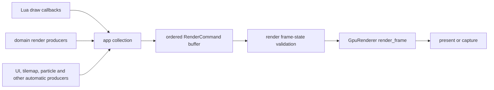

# Render Pipeline Architecture

## Purpose

The renderer turns ordered, validated render commands into a presented frame. It owns `wgpu` resources and frame execution. Domain modules, Lua bindings, scenes, UI, particles, and debug tools may request visual output, but they do not own backend objects or presentation.

## Ownership model

| Concern | Owner | Boundary |
|---|---|---|
| Game/simulation state | Domain module or Lua game state | Exposes data, descriptors, or draw requests. |
| Frame orchestration and command collection | `app` | Combines callback output and automatic subsystem output in frame order. |
| Command representation and validation | `render` | Defines `RenderCommand`, validates balanced frame state, and classifies commands. |
| GPU textures, buffers, pipelines, canvases, and submission | `render` / `GpuRenderer` | Only this layer creates, mutates, or submits backend resources. |
| UI layout, scene policy, and gameplay effects | Their domain owners | They emit commands/data; they do not acquire renderer ownership. |
| Province registry/topology/style | `province` | Builds versioned CPU `ProvinceRenderSnapshot` packets; it does not create GPU resources. |

## Per-frame data flow

The command buffer is frame-local. It is a render plan, not a canonical copy of domain state. A producer must be able to derive a new plan from its owner on the next frame.

## Collection and ordering

The application gathers commands after update callbacks and before frame execution. It preserves explicit scene/UI ordering and adds automatic subsystem output through app-owned buffers. The renderer executes the resulting order; it does not inspect the scene stack or invent gameplay ordering.

Commands carry draw operations plus state transitions such as color, transforms, blend mode, scissor/stencil state, canvas selection, shader selection, post-processing boundaries, layer/sort groups, and debug output. The public API may expose individual commands through convenience calls, but their balance and validity are enforced before the GPU path uses them.

## Frame-state invariants

`render::input_validation` guards stack and pair invariants before rendering. Any producer that emits one side of a pair owns emitting the matching close/reset in the same valid command sequence.

Important examples:

- Transform push/pop, stencil begin/end, layers, and sort groups must balance.
- Canvas, shader, scissor, blend, and color state must leave the next command in a valid defined state.
- Post-processing begin/end/apply operations must target a valid configured stack.
- A resource handle must resolve to the expected renderer-owned kind before a draw consumes it.

Validation failure is a render-plan error with command context. It must not be papered over by changing unrelated domain state or skipping arbitrary later commands.

## Resource handles and lifetime

Textures, fonts, canvases, meshes, shaders, batches, and other GPU-backed objects are held in renderer-side registries. Lua and higher-level modules use validated keys/handles or typed wrappers. Handles are not serialized GPU objects and cannot be treated as stable ownership across a renderer restart, device loss, or loaded save.

The owner that creates a resource defines its logical lifetime; the renderer defines physical GPU allocation, upload, teardown, and invalid-handle reporting. When device/window state changes, the renderer rebuilds or invalidates backend data through this boundary.

## Typed data outside the command stream

Not every visual subsystem should encode all of its state as a generic command variant. Lighting, post-processing configuration, renderer diagnostics, and similar typed frame inputs may cross as explicit typed data while the renderer remains the sole GPU executor. Use a new `RenderCommand` only when it represents an ordered frame operation; use a typed input when it is configuration/data for a renderer-owned stage.

## Module boundaries

- `render` owns command types, resource registries, validation, GPU frame execution, and capture paths.
- `app` owns collecting and ordering the frame plan across callbacks and automatic producers.
- `scene` owns which game state is active; it does not render a frame directly.
- `ui` owns retained UI state and layout; it emits its visual representation.
- `image` owns CPU image data and codecs; GPU upload/effect execution belongs to renderer paths.
- `particle`, `tilemap`, `parallax`, `raycaster`, and similar modules own their simulation/data and emit draw-ready output.
- `effect` owns user-facing effect configuration; the renderer owns shader/pipeline execution.
- `province` owns registry access, topology, border extraction, semantic styles, and snapshot change tracking. `app` refreshes snapshots at the frame boundary; `render` accepts snapshots and owns their upload formats, textures, buffers, bind groups, and residency.

Detailed pair rules live in [Module Scope Boundaries](module-scope-boundaries.md).

## Failure, capture, and diagnostics

Renderer failures retain enough context to identify the command/resource/stage that failed. Device-dependent errors follow the app/renderer recovery path; a Lua module must not retry GPU allocation by bypassing that path.

Software capture and render-to-image paths are diagnostic/test tools. They consume the same meaningful command representation where supported, but they are not an alternate owner for interactive rendering behavior or a guarantee that every GPU feature has software parity.

## Change checklist

Before adding a draw operation or renderer-facing feature:

1. Identify the domain owner of the underlying state.
2. Decide whether the boundary needs an ordered command or typed renderer input.
3. Define resource creation, validation, release, device-loss, and serialization behavior.
4. Add frame-state validation if the operation opens/closes state or changes stack discipline.
5. Cover the visible result and failure path with the appropriate example/test/evidence owner.

## Related documents

- [Engine Core](engine-core.md)
- [Lua--Rust Boundary](scripting-bridge.md)
- [Module Scope Boundaries](module-scope-boundaries.md)
- [Quality Assurance](../contributing/quality-assurance.md)
