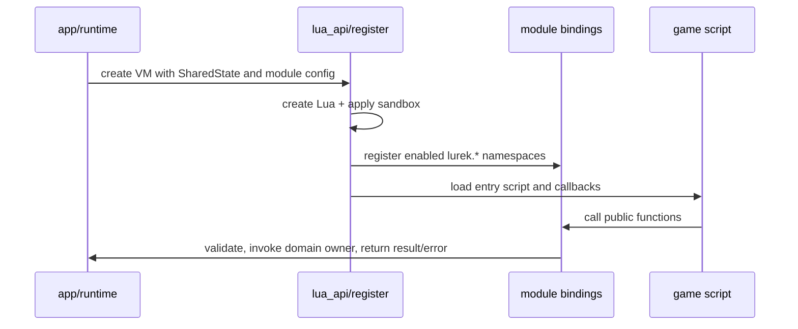

# Lua--Rust Boundary Architecture

## Purpose

`src/lua_api/` is the one public boundary between Lua scripts and Rust systems. It creates the VM, installs `lurek.*`, applies the sandbox, translates values and errors, and drives Lua callbacks. Domain modules own behavior; the binding layer owns exposure.

## Registration lifecycle

`src/lua_api/register.rs` creates the Lua VM, locks down the standard library, creates the `lurek` table, registers configured modules, and configures package resolution before application callbacks run.



The static module registry is the normal registration path. Feature-gated registrations remain explicit because the compiler, not runtime configuration, decides whether their code exists. The registry and `docs/meta/modules.toml` must agree on public namespace ownership.

## Shared state and borrowing

Bindings receive shared engine state as `Rc<RefCell<SharedState>>`. This is valid only on the Lua-owning thread; background work must use Rust-owned messages or snapshots rather than sharing the VM state.

`SharedState` coordinates runtime-wide services such as timing, input, render-command state, windows, resource registries, and configured subsystem state. It is not an alternative owner for domain algorithms or serialized game data.

Binding code must borrow only for the smallest operation. It must release a mutable borrow before invoking Lua callbacks or re-entering a Lua API path. Re-entrant calls while a `RefCell` borrow is held are a runtime failure, not an acceptable control-flow technique.

## Value and resource boundary

Lua passes scalars, tables, strings, and validated userdata into bindings. Bindings convert those values into domain inputs and return Lua-native results or structured errors.

Resources exposed to Lua use validated handles or userdata wrappers rather than Rust references. The Rust owner remains responsible for allocation, lookup, release, invalid-handle diagnostics, and cache eviction. A Lua handle is an identifier, not transfer of ownership.

```text
Lua value or handle
  -> binding validates shape and access
  -> domain/runtime owner performs operation
  -> binding returns value, handle, or contextual Lua error
```

Never serialize GPU handles, window state, Rust references, or VM references as game state. Serialize domain data; rebuild runtime resources through their owning lifecycle.

## Sandbox and filesystem policy

The VM setup restricts dangerous standard-library entry points. Scripts reach files through the engine filesystem boundary and its project/sandbox policy, not through unrestricted host filesystem or shell access.

Package-path setup supports project-local Lua modules and packaged runtime layouts. It is a resolution policy only: it must not bypass GameFS restrictions or turn arbitrary host paths into script-visible imports.

## Callbacks and failure paths

The application lifecycle owns callback ordering. Lua callbacks run only after the VM and public namespaces are ready; frame callbacks receive the current frame timing and submit work through public APIs.

When a script or binding fails, the boundary adds API context and returns an engine error to the owning runtime path. A binding must not swallow failures, leave partially-mutated shared state, or replace a domain error with an unrelated Lua panic.

Headless execution uses the same public registration path with its headless runtime configuration. Tests may omit window/GPU work where the relevant subsystem supports it, but must not silently exercise a different API contract.

## Test ownership

| Concern | Primary proof |
|---|---|
| Private conversion, validation, or resource helper | Rust unit test near the owning seam. |
| Namespace registration, marshaling, and binding errors | Rust-driven binding test with a test VM. |
| User-visible `lurek.*` behavior | Lua unit or integration test. |
| Full callback/frame interaction | Headless or integration scenario where supported. |

See [Quality Assurance](../contributing/quality-assurance.md) for placement and coverage rules, and [Lua API Authoring](../contributing/lua-api-authoring.md) for source conventions.

## Related documents

- [Engine Core](engine-core.md): application lifecycle and state ownership.
- [Render Pipeline](render-pipeline.md): command and GPU-resource boundary.
- [Module Scope Boundaries](module-scope-boundaries.md): module-level ownership rules.
- [Philosophy and Constraints](philosophy.md): dependency and public-contract constraints.
