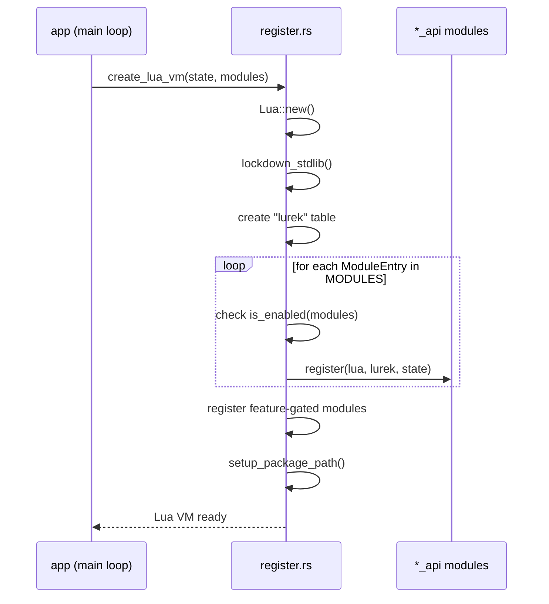

# Lua–Rust Boundary Architecture

## TL;DR

Defines how the Rust engine exposes functionality to Lua scripts: module registration, state management, the handle pattern, security sandbox, and testing strategy.

Companion documents: [engine-core.md](engine-core.md) · [philosophy.md](philosophy.md) · [quality-assurance.md](quality-assurance.md)

---

## Table of Contents

1. [Overview](#overview)
2. [Module Registration](#module-registration)
3. [State Management](#state-management)
4. [Security Sandbox](#security-sandbox)
5. [Handle Pattern](#handle-pattern)
6. [Package Path Resolution](#package-path-resolution)
7. [Testing Strategy](#testing-strategy)
8. [Future Direction](#future-direction)

---

## Overview

`src/lua_api/` lives in the **Edge/Integration** layer — the top of the module DAG. It is the sole bridge between Lua game scripts and the Rust engine. No other layer may import `mlua` types.

The boundary is **one-directional**: Rust calls into Lua (callbacks), and Lua calls into Rust (API functions). Lua never directly accesses Rust memory; Rust never directly accesses Lua internals outside `mlua`.

Key binding constraints (from [philosophy.md](philosophy.md)):

| Rule | Statement |
|------|-----------|
| B-01 | LuaJIT via `mlua 0.9` is the main runtime; `lua54` is a CI-only fallback. |
| TST-03 | `src/lua_api/<module>_api.rs` contains bindings only. Business logic stays in `src/<module>/`. |
| TST-04 | `mod.rs` files contain only `pub mod`, `pub use`, attributes, and doc comments. |
| Zen 12 | Lua bindings are thin and one-directional. |

---

## Module Registration

### The `LuaModule` Trait

Each API module can implement `LuaModule` (defined in `src/lua_api/lua_module.rs`):

```rust
pub trait LuaModule {
    const MODULE_NAME: &'static str;
    fn is_enabled(modules: &ModulesConfig) -> bool;
    fn register(lua: &Lua, lurek: &LuaTable, state: Rc<RefCell<SharedState>>) -> LuaResult<()>;
}
```

`MODULE_NAME` matches the `lurek.*` namespace for diagnostics. `is_enabled` decides whether the module loads for a given configuration. `register` installs functions and types into the `lurek` table.

### `ModuleEntry` and the Static Registry

Because associated constants prevent `dyn LuaModule`, registration uses a data-driven approach:

```rust
pub struct ModuleEntry {
    pub name: &'static str,
    pub is_enabled: fn(&ModulesConfig) -> bool,
    pub register: fn(&Lua, &LuaTable, Rc<RefCell<SharedState>>) -> LuaResult<()>,
}
```

A static `MODULES` slice in `src/lua_api/register.rs` holds all standard modules, constructed via two macros:

| Macro | Use case | Example |
|-------|----------|---------|
| `always!(api)` | Module always loads | `always!(event_api)` |
| `gated!(api, field)` | Module loads when `ModulesConfig.field` is `true` | `gated!(physics_api, physics)` |

### Feature-Gated Modules

Modules behind Cargo features (`automation-plugin`, `devtools-plugin`, `graph`, `charts`) cannot appear in the static slice because `#[cfg]` is a compile-time decision. These are registered separately after the slice iteration:

```rust
#[cfg(feature = "devtools-plugin")]
if modules.debug {
    devtools_api::register(lua, lurek, state.clone())?;
}
```

### Registration Flow



---

## State Management

### `SharedState`

All engine subsystems share a single `SharedState` instance, threaded through the boundary as:

```rust
Rc<RefCell<SharedState>>
```

**Why `Rc<RefCell<_>>`?** LuaJIT is single-threaded. The engine runs one Lua VM per thread. Within a single thread, `Rc` provides cheap reference counting without atomic overhead, and `RefCell` gives interior mutability with runtime borrow checks. This avoids `unsafe` while keeping the hot path fast.

### What `SharedState` Holds

| Category | Examples |
|----------|----------|
| Resource pools | `SlotMap<TextureKey, TextureData>`, fonts, canvases, shaders, meshes, particle systems |
| Input aggregation | Keyboard, mouse, touch, gamepad state |
| Timing | Delta time, total time, FPS, frame profile |
| Render pipeline | Blend mode, stencil, render commands buffer |
| Window state | Focus, DPI scale, fullscreen, pending resize |
| Physics config | Fixed timestep, max sub-steps, debug draw |
| Memory budget | LRU eviction, resource byte tracking |

### GC Interaction

Lua's garbage collector cannot see into Rust-owned resources. The engine tracks resource liveness in Rust (via `SlotMap` keys). When Lua drops a handle (the u64 ID goes out of scope), nothing happens immediately — Rust continues to own the resource. Explicit `release` calls or LRU eviction reclaim memory. This decouples GC pressure from GPU resource teardown.

---

## Security Sandbox

Before any module registration, `lockdown_stdlib` removes dangerous standard-library functions:

| Removed | Rationale |
|---------|-----------|
| `load`, `loadfile`, `dofile` | Prevent arbitrary code loading from disk |
| `debug` (entire table) | Prevents GC manipulation, upvalue access, hook injection |
| `os.execute`, `os.getenv` | Block shell access and environment probing |
| `io.open`, `io.popen` | Block raw filesystem and process spawning |

Game scripts access the filesystem only through `lurek.filesystem`, which operates within the sandboxed `GameFS` virtual filesystem.

---

## Handle Pattern

### Principle

Lua never holds raw pointers or Rust references. Every resource visible to Lua is represented by an opaque numeric ID (typically `u64`). Rust owns the actual data in typed maps.

### Architecture

```
┌──────────────────────┐       ┌──────────────────────────────────┐
│  Lua script          │       │  Rust (SharedState)              │
│                      │       │                                  │
│  local tex = 42      │──ID──▶│  textures: SlotMap<Key, Data>    │
│  lurek.sprite.draw(  │       │                                  │
│    tex, 100, 200)    │       │  tex = textures[Key::from(42)]   │
└──────────────────────┘       └──────────────────────────────────┘
```

### Resource Lifecycle

1. **Create** — Lua calls `lurek.image.load("player.png")`. Rust loads the image, inserts it into `textures: SlotMap<TextureKey, TextureData>`, converts the `TextureKey` to its `u64` representation via `key.data().as_ffi()`, and returns the ID to Lua.
2. **Use** — Lua passes the ID to draw calls. Rust looks up the key, validates it exists, and issues render commands.
3. **Release** — Lua calls `lurek.image.release(tex)` or the engine evicts via LRU. Rust removes the entry from the `SlotMap` and records the key in `released_texture_handles: HashSet<u64>` to detect stale-handle use.

### Why Handles?

- **GC safety** — Lua can copy IDs freely without triggering Rust borrow issues.
- **Validation** — Stale handles are detectable (key no longer in `SlotMap`).
- **No lifetimes** — Avoids Rust lifetime annotations in `mlua` userdata.
- **Serialisable** — IDs survive save/load boundaries.

---

## Package Path Resolution

`setup_package_path` extends Lua's `package.path` so `require` resolves game scripts:

```
;./?/init.lua
;./?.lua
;./content/?/init.lua
;./content/?.lua
;{exe_dir}/?/init.lua
;{exe_dir}/?.lua
;{exe_dir}/content/?/init.lua
;{exe_dir}/content/?.lua
```

This supports two scenarios:
- **Development** — `cargo run` from the repo root; CWD-relative paths resolve library and content modules.
- **Distribution** — The packaged binary resolves relative to the executable directory, allowing games to ship alongside the binary.

---

## Testing Strategy

The Lua–Rust boundary uses a three-layer testing approach (detailed in [quality-assurance.md](quality-assurance.md)):

### Layer 1: Rust Unit Tests

Pure Rust logic in `src/<module>/` is tested in `tests/rust/unit/<module>_tests.rs`. No Lua involvement. Fast, isolated, and covers algorithm correctness.

### Layer 2: Binding Tests (Rust-driven)

`create_test_vm()` spins up a headless Lua VM with default module configuration:

```rust
pub fn create_test_vm() -> LuaResult<Lua> {
    let state = Rc::new(RefCell::new(SharedState::new(800, 600, "Test", PathBuf::from("."))));
    let modules = Config::default().modules;
    create_lua_vm(state, &modules)
}
```

Tests verify that Rust functions are correctly exposed, types marshal properly, and error paths return meaningful messages.

### Layer 3: Lua Integration Tests

Scripts in `tests/lua/` exercise the `lurek.*` API from the game-author perspective. These run through the engine's test harness in headless mode — no window, no GPU context required. CI executes these without a display server.

### Headless Mode

`create_headless_vm` applies a headless profile that disables windowing, GPU rendering, and audio output. All other subsystems remain operational. This enables full API testing in CI environments.

---

## Future Direction

These are planned improvements, not current state:

| Direction | Status | Notes |
|-----------|--------|-------|
| Per-module `LuaModule` trait impls | In progress | Replaces free-function `register` with trait-based dispatch |
| Inventory-based auto-registration | Planned | `inventory` crate would auto-collect `ModuleEntry` items, removing the manual `MODULES` slice |
| Crate extraction | Considered | Moving `lua_api` to a separate crate would enforce the binding-only contract at the crate boundary |
| Typed handles via newtype wrappers | Considered | Replace bare `u64` at the Lua boundary with per-resource newtypes for compile-time safety |

---

## Related Documents

- [engine-core.md](engine-core.md) — Full runtime architecture
- [philosophy.md](philosophy.md) — Design constraints and binding rules
- [quality-assurance.md](quality-assurance.md) — Test placement and layer rules
- [render-pipeline.md](render-pipeline.md) — GPU pipeline details

---

## Code & Documentation Standards

## Engine Coding Standards

### Pinned Crate Policy
The Lurek2D engine relies on strictly defined versions of base libraries. Any attempts to update without Architect approval are rejected:
- **Rust**: `stable >= 1.78` (enforced via rust-toolchain.toml)
- **mlua**: `0.9` with features `["luajit", "vendored"]`
- **wgpu**: `22`
- **winit**: `0.30`
- **rapier2d**: `0.32`
- **rodio**: `0.17`
- **fontdue**: `0.9`

### File Structure & `mod.rs` Strictness
Each `mod.rs` file in the engine must be a pure re-export point. It is strictly forbidden to place any business logic, functions, structs, or unit tests (`#[cfg(test)]`) in `mod.rs` files.
Allowed contents:
- `pub mod <name>;`
- `pub use <path>;`
- Module attributes (e.g. `#[allow(...)]`)
- Doc comments (`///` or `//!`)

### Safe State Borrowing
When calling Lua callbacks from the Rust engine, there is a critical risk of panicking (`RefCell::borrow_mut() already borrowed`). The coding standard strictly enforces dropping the `borrow_mut()` lock before entering the virtual machine boundary:

```rust
// CORRECT: Borrow lock is dropped before Lua callback
let value_to_pass = {
    let guard = state.borrow();
    guard.some_field.clone()
};
lua_callback(value_to_pass)?; // Safe call

// INCORRECT: The guard lives on the same stack as the Lua callback.
// If the Lua script re-entrantly calls an engine function trying to mutably borrow state -> PANIC.
let guard = state.borrow();
lua_callback(guard.some_field.clone())?;
```

### Error Propagation on Environment Boundaries
Every error passed across the Lua-Rust boundary must include clear context indicating the call site. Errors cannot be passed in their raw form:

**Error Format:** `lurek.<module>.<function>: <error description>`

Example:
```rust
methods.add_method("load", |_, this, path: String| {
    this.inner.load(&path).map_err(|e| {
        LuaError::RuntimeError(format!("lurek.audio.load: failed to load file from path '{}': {}", path, e))
    })
});
```

### Type Naming and Validation
- Lua-exposed types are prefixed with `Lua` in Rust (e.g., `LuaVec2`) and are visible to Lua as `L` (e.g., `LVec2`).
- Boundary validation must happen before casting (e.g., checking integer ranges before casting `i64 -> u32` or clamping floats to logical boundaries).

## Lua Scripting Standards

### `lurek.*` Exclusivity
Absolute rule: all engine API calls must use `lurek.*`. No bare globals, no `engine.*` tables, and no alternative namespaces.

### Lifecycle Separation (on_process vs on_render)
State mutation and logic must happen in `on_process(dt)`. Pure drawing without mutation must happen in `on_render()`. Mixing these callbacks causes undefined behavior.

### Multiply by `dt`
Every movement, physics simulation, timer, or tween must be multiplied by `dt`.

### Local State (No Scene-Surviving Upvalues)
State should be kept in `local` variables or explicit state tables. Module-level upvalues that survive scene transitions are forbidden.

### Relative Resource Paths
Paths must be relative to the game's content root (the folder with `conf.lua`). Use `/`, never `..`.

## Appendix: Complete LuaUserData Example

```rust
//! `lurek.shape` — Shape creation and collision query bindings.

use super::SharedState;
use crate::shape::{Circle, Rect};
use mlua::prelude::*;

// ── LuaCircle ────────────────────────────────────────────────────────────────

/// Lua-visible handle for a circle shape used in queries and collision checks.
pub struct LuaCircle {
    /// Wrapped circle data: center and radius in world units.
    pub inner: Circle,
}

/// Provides Lua fields and methods for circle shape operations.
impl LuaUserData for LuaCircle {
    fn add_fields<'lua, F: LuaUserDataFields<'lua, Self>>(fields: &mut F) {
        /// X coordinate of the circle center in world units.
        fields.add_field_method_get("x", |_, this| Ok(this.inner.x as f64));
        fields.add_field_method_set("x", |_, this, v: f64| {
            this.inner.x = v as f32;
            Ok(())
        });
        /// Y coordinate of the circle center in world units.
        fields.add_field_method_get("y", |_, this| Ok(this.inner.y as f64));
        fields.add_field_method_set("y", |_, this, v: f64| {
            this.inner.y = v as f32;
            Ok(())
        });
        /// Radius of the circle in world units; must be positive.
        fields.add_field_method_get("radius", |_, this| Ok(this.inner.radius as f64));
        fields.add_field_method_set("radius", |_, this, v: f64| {
            this.inner.radius = (v as f32).max(0.0);
            Ok(())
        });
    }

    fn add_methods<'lua, M: LuaUserDataMethods<'lua, Self>>(methods: &mut M) {
        // -- contains --
        /// Returns whether a point is inside this circle.
        /// @param | px | number | Point x coordinate in world units.
        /// @param | py | number | Point y coordinate in world units.
        /// @return | boolean | True when the point is within or on the circle boundary.
        methods.add_method("contains", |_, this, (px, py): (f64, f64)| {
            Ok(this.inner.contains(px as f32, py as f32))
        });

        // -- overlaps --
        /// Returns whether this circle overlaps another circle.
        /// @param | other | LCircle | Other circle handle.
        /// @return | boolean | True when the circles intersect or touch.
        methods.add_method("overlaps", |_, this, other: LuaAnyUserData| {
            let o = other.borrow::<LuaCircle>()?;
            Ok(this.inner.overlaps(o.inner))
        });

        // -- area --
        /// Returns the area of this circle.
        /// @return | number | Area in square world units.
        methods.add_method("area", |_, this, ()| {
            Ok(this.inner.area() as f64)
        });

        // -- type --
        /// Returns the Lua-visible type name for this circle handle.
        /// @return | string | The string `LCircle`.
        methods.add_method("type", |_, _, ()| Ok("LCircle"));

        // -- typeOf --
        /// Returns whether this handle matches a supported type name.
        /// @param | name | string | Type name to compare against `LCircle` and `Object`.
        /// @return | boolean | True when the supplied name matches this handle.
        methods.add_method("typeOf", |_, _, name: String| {
            Ok(name == "LCircle" || name == "LObject")
        });
    }
}

// ── Registration ─────────────────────────────────────────────────────────────

/// Registers the `lurek.shape` table and all its constructor functions into the Lua VM.
pub fn register(lua: &Lua, _state: &SharedState) -> mlua::Result<()> {
    let shape = lua.create_table()?;

    // -- newCircle --
    shape.set("newCircle", lua.create_function(|lua, (x, y, r): (f64, f64, f64)| {
        let radius = (r as f32).max(0.0);
        lua.create_userdata(LuaCircle {
            inner: Circle { x: x as f32, y: y as f32, radius },
        })
    })?)?;

    lua.globals().get::<_, mlua::Table>("lurek")?.set("shape", shape)?;
    Ok(())
}
```

# Lua API File Standard

## TL;DR

- 1.


> Canonical reference for the structure, docstring format, and registration patterns
> used in every `src/lua_api/*_api.rs` file.

## Table of Contents

 [File Structure](#1-file-structure)
2. [Docstring Format](#2-docstring-format)
3. [Section Separators](#3-section-separators)
4. [UserData Types](#4-userdata-types)
5. [Register Function](#5-register-function)
6. [Enum / Constant Registration](#6-enum--constant-registration)
7. [Naming Conventions](#7-naming-conventions)
8. [Scanner Compatibility](#8-scanner-compatibility)

---

## 1. File Structure

This standard applies to `src/lua_api/*_api.rs` files only.

Related bridge files:
- `src/lua_api/mod.rs` stays thin and only re-exports modules or public items.
- `src/lua_api/register.rs` owns `create_lua_vm` and module registration order.
- `src/lua_api/lua_types.rs` owns shared Lua-visible type helpers.

Every `src/lua_api/<module>_api.rs` file follows this order:

```
1. File header          //! `lurek.module` - Brief description.
2. Imports              use super::SharedState; use mlua::prelude::*; ...
3. Helper functions     (optional, private, non-Lua helpers only)
4. UserData structs     (optional) pub struct LuaFoo { ... }
5. impl LuaUserData     (optional) impl LuaUserData for LuaFoo { ... }
6. register function    pub fn register(lua, lurek, state) -> LuaResult<()>
```

### 1.1 File Header

```rust
//! `lurek.module` - Brief one-sentence description.
```

Rules:
- First line: `//!` + space + backtick-wrapped module name + ` - ` (ASCII hyphen) + description.
- Module name MUST exactly match the key in `lurek.set("module", tbl)`.
- Use backticks, not single quotes.
- Use ASCII only in headers and separators.

### 1.2 Imports

```rust
use super::SharedState;
use mlua::prelude::*;
use std::cell::RefCell;
use std::rc::Rc;

use crate::module_name::DomainType;
```

Rules:
- ALWAYS `use mlua::prelude::*`.
- `use super::SharedState` first when shared state is needed.
- Standard library imports next.
- Blank line before `crate::...` imports.
- No business logic in helper functions; wrappers only convert, validate lightly, and delegate.

---

## 2. Docstring Format

### 2.1 Module-Level Functions (in `register()`)

```rust
    // -- functionName --
    /// Brief one-sentence description.
    /// @param | paramName | type | Description text.
    /// @param | optionalParam | type? | Description text.
    /// @return | returnType | Description text.
    let s = state.clone();
    tbl.set("functionName", lua.create_function(move |_, arg: T| {
        Ok(s.borrow().method(arg))
    })?)?;
```

### 2.2 UserData Methods (in `impl LuaUserData`)

```rust
        // -- methodName --
    /// Brief one-sentence description.
    /// @param | paramName | type | Description text.
    /// @return | returnType | Description text.
        methods.add_method("methodName", |_, this, arg: T| {
            Ok(this.inner.method(arg))
        });
```

### 2.3 Tag Reference

| Tag | Format | Example |
|-----|--------|---------|
| Description | `/// One sentence.` | `/// Returns the delta time in seconds.` |
| Parameter | `/// @param | name | type | description` | `/// @param | delay | number | Delay in seconds.` |
| Optional param | `/// @param | name | type? | description` | `/// @param | tag | string? | Optional tag filter.` |
| Varargs | `/// @param | ... | type | description` | `/// @param | ... | string | Additional event parts.` |
| Return | `/// @return | type | description` | `/// @return | number | Delta time in seconds.` |
| Multi-return | `/// @return | type, type | description` | `/// @return | integer, integer | Width and height.` |
| No return value | `/// @return | nil | No value is returned.` | |

### 2.4 Lua Type Names

| Rust type | Write as |
|-----------|----------|
| `bool` | `boolean` |
| `f32` / `f64` | `number` |
| `i32` / `i64` / `u32` / `u64` / `usize` | `integer` |
| `String` / `&str` | `string` |
| `Option<T>` parameter | `type?` (e.g. `string?`) |
| `LuaTable` | `table` |
| `LuaFunction` | `function` |
| `LuaValue` | Concrete Lua type or constrained union when known (for example `table|integer`); otherwise use `LuaValue`, the generated alias for an unconstrained Lua runtime value |
| `Vec<T>` | `table` |
| UserData wrapper | Lua-visible display name (e.g. `LCamera`, `LButton`, `LScheduler`) |
| No return value | `nil` |

### 2.5 Docstring Rules

1. **One sentence only**: The first `///` line is a single sentence on a single line.
2. **Order**: description -> `@param` lines -> one `@return` line.
3. **Pipe format only**: Use `@param | ... | ... | ...` and `@return | ... | ...`.
4. **No legacy syntax**: Do not use `@param name type`, `@param name : type`, or `@return type`.
5. **No `# Parameters` / `# Returns`**: Only `@param` / `@return` tags.
6. **Fixed return shape only**: Allowed: `nil`, one fixed type, or a fixed tuple like `boolean, number`. Forbidden: `?`, `|nil`, and other unions in `@return`.
7. **Placement**: Docstring sits above the optional `let s = state.clone();` line and the corresponding registration call.
8. **Every function/method MUST have at least a description and `@return`**.
9. **Prefer precise dynamic types**: For `LuaValue` inputs, document the accepted Lua shape explicitly (`table|integer`, `string|table`, and so on) whenever it is known. Only use `LuaValue` when the value is truly unconstrained at the Lua API surface. Do not introduce raw `any` or `unknown` placeholders in source docstrings.

### 2.6 Description Line Rules

- First `///` line is always a one-sentence description (no tag prefix).
- Ends with a period.
- Starts with a verb: "Returns...", "Sets...", "Creates...", "Schedules...".
- For getters: "Returns the current X."
- For setters: "Sets the X value."
- For predicates: "Returns whether X is Y."
- Do not add a second free-text `///` line. Put details into the `@param` or `@return` description field.

---

## 3. Section Separators

### 3.1 Major Section Separator

Used between file-level sections (Helpers, UserData, Register):

```rust
// ---------------------------------------------------------------------------
// Section Name
// ---------------------------------------------------------------------------
```

- ASCII dashes only.
- Section name on its own `//` line between two separator lines.
- Standard labels: `Helpers`, `LuaFoo UserData`, `Register`.

### 3.2 Function/Method Separator

Used before every individual function or method docstring:

```rust
        // -- methodName --
```

- Indent matches the surrounding code (4 spaces in `register`, 8 spaces in `impl LuaUserData`).
- Exactly: `// -- camelCaseName --`.
- Must match the Lua-side name registered in `tbl.set("name", ...)` or `methods.add_method("name", ...)`.

### 3.3 Subsection Headers (optional)

For grouping related functions within a section:

```rust
    // -- Timing ----------------------------------------------------
```

- Prefer the major ASCII separator instead. Subsection headers are optional.

---

## 4. UserData Types

### 4.1 Struct Declaration

```rust
/// Lua-side wrapper around [`DomainType`].
pub struct LuaFoo {
    inner: DomainType,
}
```

Rules:
- Struct name: `Lua` prefix + PascalCase domain name (e.g. `LuaCamera2D`, `LuaScheduler`).
- `///` doc comment above the struct.
- Fields hold: typed resource keys, domain type references, cached read-only metadata.
- NO `wgpu` or GPU resources in UserData structs.

### 4.2 impl LuaUserData

```rust
impl LuaUserData for LuaFoo {
    fn add_methods<'lua, M: LuaUserDataMethods<'lua, Self>>(methods: &mut M) {
        // -- methodName --
        /// Description.
        /// @param | arg | type | Description text.
        /// @return | type | Description text.
        methods.add_method("methodName", |_, this, arg: T| {
            Ok(this.inner.method(arg))
        });
    }
}
```

Rules:
- `type()` and `typeOf()` methods come last.
- `type()` returns the canonical Lua-visible type string.
- `typeOf()` checks `name == "ThisType" || name == "Object"` or equivalent parent alias set.
- Do not embed business rules in `add_methods`; delegate to domain code.

---

## 5. Register Function

Standard shape:

```rust
pub fn register(lua: &Lua, lurek: &LuaTable, state: Rc<RefCell<SharedState>>) -> LuaResult<()> {
    let tbl = lua.create_table()?;

    // -- functionName --
    /// Description.
    /// @return | nil | No value is returned.
    tbl.set("functionName", lua.create_function(|_, ()| Ok(()))?)?;

    lurek.set("module", tbl)?;
    Ok(())
}
```

Rules:
- Function name is always `register`.
- Final line MUST be `lurek.set("module", tbl)?;` with exact module key.
- No side effects during registration beyond table creation and callback/userdata setup.

---

## 6. Enum / Constant Registration

Constants inside the module table should still follow the same nearby section style when they are grouped by helper functions or builders.

Rules:
- Prefer plain `tbl.set("NAME", value)?;` for constants.
- For enum-like string constants, document the function that consumes them rather than every constant unless the constant table is itself user-facing.

---

## 7. Naming Conventions

- File name: `<module>_api.rs`
- Module namespace: `lurek.<module>`
- UserData wrapper: `LuaTypeName`
- Lua-exposed function names: camelCase.
- Rust helper names: snake_case.
- Type method order: constructor helpers first, state mutation next, queries after that, `type` / `typeOf` last.

---

## 8. Scanner Compatibility

The doc generators and validators depend on predictable local structure.

Rules:
- Keep the `// -- name --` marker directly above the matching doc block.
- Keep the doc block directly above the registration call or method registration call.
- Do not insert unrelated comments between separator, doc block, and registered function.
- Keep `@return` syntax fixed-width and free of optional-return markers.
- If a method accepts optional Lua values, express that in `@param`, not `@return`.

