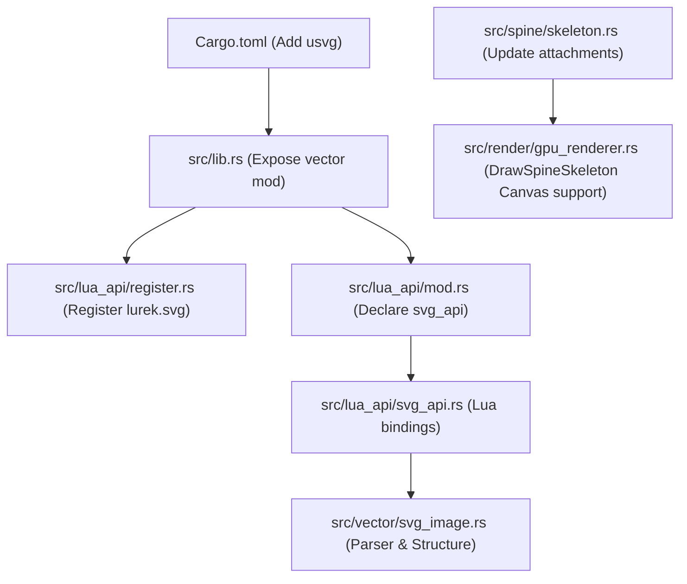
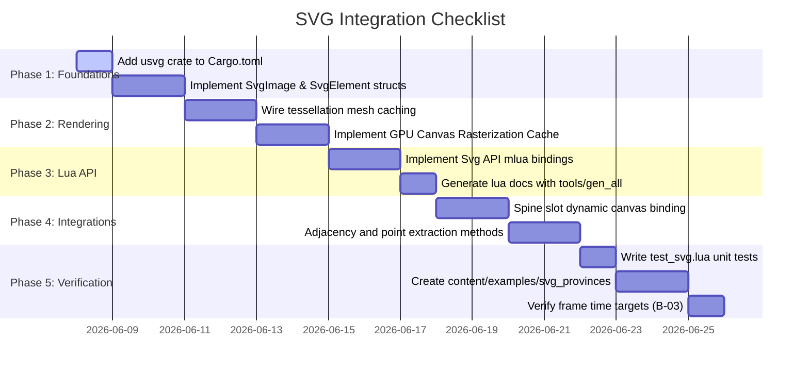

# Technical Implementation Plan: SVG Vector Graphics Support in Lurek2D

This document details the design, architecture, file paths, Rust signatures, and Lua API specifications for integrating high-performance SVG (Scalable Vector Graphics) support into the Lurek2D engine.

---

## 1. Goal and Objectives

Integrating vector graphics in SVG format will solve limitations in high-zoom scenarios (pixelization) and reduce memory footprint for massive assets such as regional map grids (provinces).

### Key Architectural Requirements
1. **GPU-Accelerated Vector Drawing**: Utilize Lurek2D's existing `RenderCommand::DrawPath` and `gpu_tess.rs` pipeline.
2. **Dynamic Scene Graph & Node State**: Toggle visibility, overwrite fill/stroke colors, and apply translations/rotations/scaling on individual SVG elements or groups (`<g>`) on the fly.
3. **Spine Attachment Integration**: Allow using specific SVG elements/groups as attachments inside slot animations, automatically caching them into GPU canvases.
4. **Frame-by-frame Animation Integration**: Create Poklatkowa (frame-based) animations using SVG layers or groups as frame frames.
5. **Province Cartography Integrator**: Extract simplified polygons for province hit-testing (point-in-polygon) and automatically calculate adjacency lists from shared vector boundaries.

---

## 2. Dependency Selection

Add `usvg` to the cargo workspace to parse SVG files and resolve CSS styles, gradients, and shape geometry (rectangles, circles, polygons) by converting them into unified Bezier path elements.

### File: `Cargo.toml`
Add the following line under `[dependencies]`:
```toml
usvg = { version = "0.36", default-features = false }
```
*Note: This version is compatible with Rust 1.78+ compiler bounds defined in `Lurek2D`.*

---

## 3. Architecture & Internal Rust Structures

We will introduce a new module: `crate::vector`.

### File: [NEW] `src/vector/mod.rs`
```rust
//! Vector graphics engine module for loading, parsing, managing, and rendering SVG trees.
pub mod svg_image;
pub use svg_image::{SvgImage, SvgElement, SvgPath};
```

### File: [NEW] `src/vector/svg_image.rs`
```rust
use crate::math::Vec2;
use crate::render::renderer::{PathSegment, CanvasKey};
use std::collections::HashMap;

/// Represents a single path element (or shape normalized to path) in the SVG.
#[derive(Clone, Debug)]
pub struct SvgPath {
    pub segments: Vec<PathSegment>,
    pub fill_color: Option<[f32; 4]>,
    pub stroke_color: Option<[f32; 4]>,
    pub stroke_width: f32,
}

/// Represents an SVG group (<g>) or path (<path>) element inside the scene graph.
#[derive(Clone, Debug)]
pub struct SvgElement {
    pub id: String,
    pub is_group: bool,
    pub parent_id: Option<String>,
    pub child_ids: Vec<String>,
    
    // Original local transform parsed from SVG
    pub local_transform: [f32; 9], // 3x3 row-major affine transform matrix
    
    // Dynamic runtime overrides (mutated via Lua)
    pub visible: bool,
    pub color_override: Option<[f32; 4]>,
    pub translation: Vec2,
    pub rotation: f32,
    pub scale: Vec2,
    
    // Paths contained in this element (empty if group)
    pub paths: Vec<SvgPath>,
    
    // GPU Mesh Cache (for high-performance vertex cache)
    // Avoids re-tessellating Bezier curves on the CPU if geometry doesn't change
    pub mesh_cache: Option<crate::render::mesh::Mesh>,
}

/// The root resource representing a parsed SVG vector document.
pub struct SvgImage {
    pub width: f32,
    pub height: f32,
    pub root_id: String,
    pub elements: HashMap<String, SvgElement>,
    
    // Offscreen GPU texture cache keys mapped to element IDs
    pub cached_canvases: HashMap<String, CanvasKey>,
}

impl SvgImage {
    /// Parses an SVG file from raw bytes (loaded via GameFS).
    pub fn from_bytes(bytes: &[u8], label: &str) -> Result<Self, String> {
        let opt = usvg::Options::default();
        let tree = usvg::Tree::from_data(bytes, &opt)
            .map_err(|e| format!("Failed to parse SVG '{}': {}", label, e))?;
        
        let width = tree.size.width() as f32;
        let height = tree.size.height() as f32;
        
        let mut elements = HashMap::new();
        // Traverse usvg nodes and populate flattened scene graph in `elements`
        // usvg automatically converts <rect>, <circle>, <polygon>, etc., into paths!
        
        Ok(Self {
            width,
            height,
            root_id: "root".to_string(),
            elements,
            cached_canvases: HashMap::new(),
        })
    }
}
```

---

## 4. Lua API Specifications

The new API will be bound under the global `lurek.svg` table. It will expose the `LSvgImage` userdata wrapper.

### File: [NEW] `src/lua_api/svg_api.rs`
This file implements the Lua bindings using `mlua`.

```rust
use crate::lua_api::SharedState;
use crate::vector::SvgImage;
use mlua::prelude::*;
use std::cell::RefCell;
use std::rc::Rc;

pub struct LuaSvgImage {
    pub inner: Rc<RefCell<SvgImage>>,
    pub state: Rc<RefCell<SharedState>>,
}

impl LuaUserData for LuaSvgImage {
    fn add_methods<'lua, M: LuaUserDataMethods<'lua, Self>>(methods: &mut M) {
        // -- getWidth --
        /// Returns the default width of the SVG viewBox.
        /// @return | number | Width in points/pixels.
        methods.add_method("getWidth", |_, this, ()| {
            Ok(this.inner.borrow().width)
        });

        // -- getHeight --
        /// Returns the default height of the SVG viewBox.
        /// @return | number | Height in points/pixels.
        methods.add_method("getHeight", |_, this, ()| {
            Ok(this.inner.borrow().height)
        });

        // -- draw --
        /// Submits render commands for drawing the entire SVG or active nodes.
        /// @param | x | number | X position coordinate.
        /// @param | y | number | Y position coordinate.
        /// @param | rotation | number? | Rotation angle in radians (default 0).
        /// @param | sx | number? | X-scale factor (default 1).
        /// @param | sy | number? | Y-scale factor (default 1).
        /// @param | ox | number? | X origin offset for rotation (default 0).
        /// @param | oy | number? | Y origin offset for rotation (default 0).
        methods.add_method("draw", |_, this, (x, y, rotation, sx, sy, ox, oy): (f32, f32, Option<f32>, Option<f32>, Option<f32>, Option<f32>, Option<f32>)| {
            let mut st = this.state.borrow_mut();
            // Traverses elements, aggregates transform matrices using existing PushTransform/ApplyTransform,
            // and appends RenderCommand::DrawPath commands to st.render_commands queue.
            Ok(())
        });

        // -- getElementIds --
        /// Returns a table containing all unique element IDs parsed from the SVG.
        /// @return | string[] | Array of string IDs.
        methods.add_method("getElementIds", |lua, this, ()| {
            let svg = this.inner.borrow();
            let keys: Vec<String> = svg.elements.keys().cloned().collect();
            let t = lua.create_table()?;
            for (i, key) in keys.into_iter().enumerate() {
                t.set(i + 1, key)?;
            }
            Ok(t)
        });

        // -- setElementVisible --
        /// Toggles rendering of an element or group.
        /// @param | id | string | Node ID.
        /// @param | visible | boolean | True to render, false to hide.
        methods.add_method_mut("setElementVisible", |_, this, (id, visible): (String, bool)| {
            let mut svg = this.inner.borrow_mut();
            if let Some(el) = svg.elements.get_mut(&id) {
                el.visible = visible;
            }
            Ok(())
        });

        // -- setElementColor --
        /// Overrides the fill or stroke color of a path node.
        /// @param | id | string | Node ID.
        /// @param | r | number | Red (0..255).
        /// @param | g | number | Green (0..255).
        /// @param | b | number | Blue (0..255).
        /// @param | a | number? | Alpha (0..255, default 255).
        methods.add_method_mut("setElementColor", |_, this, (id, r, g, b, a): (String, f32, f32, f32, Option<f32>)| {
            let mut svg = this.inner.borrow_mut();
            if let Some(el) = svg.elements.get_mut(&id) {
                el.color_override = Some([r / 255.0, g / 255.0, b / 255.0, a.unwrap_or(255.0) / 255.0]);
            }
            Ok(())
        });

        // -- setElementTransform --
        /// Adds runtime transformation parameters on top of local SVG transform.
        /// @param | id | string | Node ID.
        /// @param | tx | number | Translation X.
        /// @param | ty | number | Translation Y.
        /// @param | rotation | number | Rotation angle in radians.
        /// @param | sx | number | Scale X.
        /// @param | sy | number | Scale Y.
        methods.add_method_mut("setElementTransform", |_, this, (id, tx, ty, rotation, sx, sy): (String, f32, f32, f32, f32, f32)| {
            let mut svg = this.inner.borrow_mut();
            if let Some(el) = svg.elements.get_mut(&id) {
                el.translation = Vec2::new(tx, ty);
                el.rotation = rotation;
                el.scale = Vec2::new(sx, sy);
            }
            Ok(())
        });

        // -- getElementPoints --
        /// Tessellates path curves into straight lines and returns the outline coordinates.
        /// @param | id | string | Node ID.
        /// @param | step_size | number? | Arc division density parameter (default 1.0).
        /// @return | table | Array of coordinate tuples: {{x1, y1}, {x2, y2}, ...}
        methods.add_method("getElementPoints", |lua, this, (id, step_size): (String, Option<f32>)| {
            let svg = this.inner.borrow();
            let el = svg.elements.get(&id).ok_or_else(|| LuaError::RuntimeError(format!("Element '{}' not found", id)))?;
            let pts = lua.create_table()?;
            // Iterates path segments, evaluates Beziers using step_size (Euler/De Casteljau division),
            // and appends coordinates into the Lua table.
            Ok(pts)
        });

        // -- getAdjacencies --
        /// Audits polygon boundaries of elements with given prefix and detects shared border edges.
        /// @param | prefix | string | Filter prefix (e.g. "prov_").
        /// @param | epsilon | number? | Border distance matching tolerance (default 0.1).
        /// @return | table | Array of pairs: {{a = "prov_1", b = "prov_2"}, ...}
        methods.add_method("getAdjacencies", |lua, this, (prefix, epsilon): (String, Option<f32>)| {
            let svg = this.inner.borrow();
            let eps = epsilon.unwrap_or(0.1);
            let result = lua.create_table()?;
            // Extract outlines of nodes starting with `prefix`, detect overlap borders,
            // and fill adjacency map into Lua table.
            Ok(result)
        });

        // -- cacheToCanvas --
        /// Triggers GPU rasterization cache on a specific group or element, drawing it once onto a texture.
        /// @param | id | string | Element or group ID.
        /// @param | width | integer | Texture cache width.
        /// @param | height | integer | Texture cache height.
        /// @return | boolean | True when successfully cached.
        methods.add_method_mut("cacheToCanvas", |_, this, (id, w, h): (String, u32, u32)| {
            let mut svg = this.inner.borrow_mut();
            let mut st = this.state.borrow_mut();
            // 1. Generate unique CanvasKey for element
            // 2. Queue RenderCommand::RegisterCanvas
            // 3. Queue RenderCommand::SetCanvas
            // 4. Render element shapes
            // 5. Restore canvas to default and save CanvasKey in svg.cached_canvases
            Ok(true)
        });

        // -- getCanvasKey --
        /// Returns the offscreen canvas key for attachment purposes (e.g., Spine skeletal slot bindings).
        /// @param | id | string | Element ID.
        /// @return | string? | Canvas key string, or nil if not cached.
        methods.add_method("getCanvasKey", |_, this, id: String| {
            let svg = this.inner.borrow();
            if let Some(canvas_key) = svg.cached_canvases.get(&id) {
                // Return string representation of CanvasKey
                Ok(Some(canvas_key.to_string()))
            } else {
                Ok(None)
            }
        });
    }
}
```

---

## 5. Engine File Modifications

To integrate the new vector module, several key files of the Lurek2D engine must be modified.



### 5.1 File: `src/lib.rs`
Expose the new module group.
```rust
// Around line 85 (near other modules)
pub mod vector;
```

### 5.2 File: `src/lua_api/mod.rs`
Expose the SVG Lua binding module.
```rust
// Around line 74
/// Exposes the `lurek.svg` binding module.
pub mod svg_api;
```

### 5.3 File: `src/lua_api/register.rs`
Register the vector API during Lua VM initialization.
```rust
// Inside create_lua_vm / register functions (around line 120):
svg_api::register(lua, &lurek, state.clone())?;
```

### 5.4 File: `src/render/gpu_renderer.rs` & `src/spine/skeleton.rs` (Spine Integration)
Ensure Spine can accept Canvas texture keys dynamically rendered from SVGs:
1. Update `SpineSlotDraw` in `src/render/renderer.rs` to allow slot attachments to use `CanvasKey` in addition to `TextureKey`.
2. Update `RenderCommand::DrawSpineSkeleton` handling in `src/render/gpu_renderer.rs` (lines 3017-3050):
   If `slot.texture_key` points to a dynamic canvas (or if we support canvas keys), resolve it from `canvases` registry rather than `gpu_textures`.
   ```rust
   // Inside RenderCommand::DrawSpineSkeleton handler:
   let tex_ref = if let Some(canvas) = canvases.get(slot.canvas_key) {
       TexRef::Canvas(slot.canvas_key)
   } else {
       TexRef::Texture(slot.texture_key)
   };
   ```

---

## 6. GPU Performance Caching Strategy

Vector curves tessellated on-demand are expensive. We will implement a dual-caching pipeline:

### 6.1 Vertex Mesh Caching (Zero CPU overhead)
When rendering vector shapes directly:
1. Tessellation converts Beziers to flat arrays of float triangles (`ColorVertex`).
2. Instead of calling `tess_polygon` every frame, `SvgImage` stores the output in a cache: `el.mesh_cache`.
3. Subsequent frames execute `RenderCommand::DrawMesh` using the cached GPU mesh.
4. If translation/rotation/scaling occurs, Lurek2D submits matrix transformations to the GPU stack, avoiding CPU mesh updates.

### 6.2 GPU Canvas Baking (Fastest O(1) Draw Calls)
When using Spine or rendering ultra-complex structures:
1. The script calls `svg:cacheToCanvas("my_group", width, height)`.
2. The engine rasterizes the SVG element once onto an offscreen canvas target.
3. On render frames, this canvas is bound as a regular texture. This runs as a single quad draw command, matching the performance of raster PNGs while retaining resolution-independence at the baking stage.

---

## 7. Module Integrations

### 7.1 Spine Integration Flow (Dynamic Vector Attachments)
1. Load skeletal animation: `local skeleton = lurek.spine.load("hero.json")`
2. Load vector skin elements: `local svg = lurek.svg.load("hero_gear.svg")`
3. Bake vector armors: `svg:cacheToCanvas("armor_chest", 256, 256)`
4. Retrieve the texture reference: `local canvasKey = svg:getCanvasKey("armor_chest")`
5. Bind to Spine: `skeleton:setSlotAttachment("chest_slot", canvasKey)`
6. When rendering, Spine positions the SVG-rasterized quad according to bone IK transforms automatically.

### 7.2 Animation Integration Flow (Poklatkowa Frame Toggle)
```lua
local animation = lurek.animation.newController()
local animSvg = lurek.svg.load("warrior_run.svg")

-- Each frame is a group in SVG: <g id="frame_0">, <g id="frame_1"> ...
local totalFrames = 8

function update(dt)
    animation:update(dt)
    local currentFrame = math.floor(animation:getTime() * 12) % totalFrames
    
    -- Toggle visibility to animate poklatkowo
    for i = 0, totalFrames - 1 do
        animSvg:setElementVisible("frame_" .. i, i == currentFrame)
    end
end

function draw()
    animSvg:draw(100, 100)
end
```

---

## 8. Step-by-Step Implementation Roadmap


